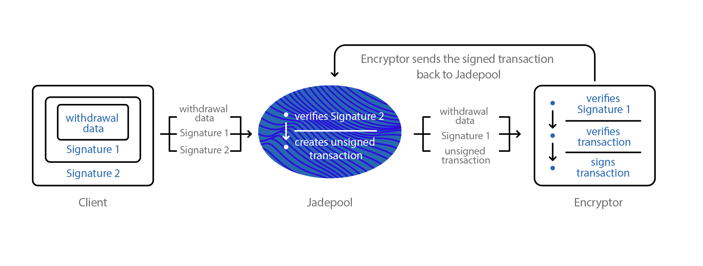

HSM is an application data security hardware customized for Jadepool. It is a physically secure hardware that takes the key security role of generating and storing seed, deriving and recovering private keys, verifying requests, signing transactions and storing critical data. HSM also integrates the logic of transferring assets from Jadepool to cold wallet. Furthermore, HSM uses multi-signature encrypted USB keys to achieve secure management, including seed backup, reset password, query and modify configuration etc. Every operation requires authorizations from a certain number of private key holders.

 

HSM Illustration：

 

