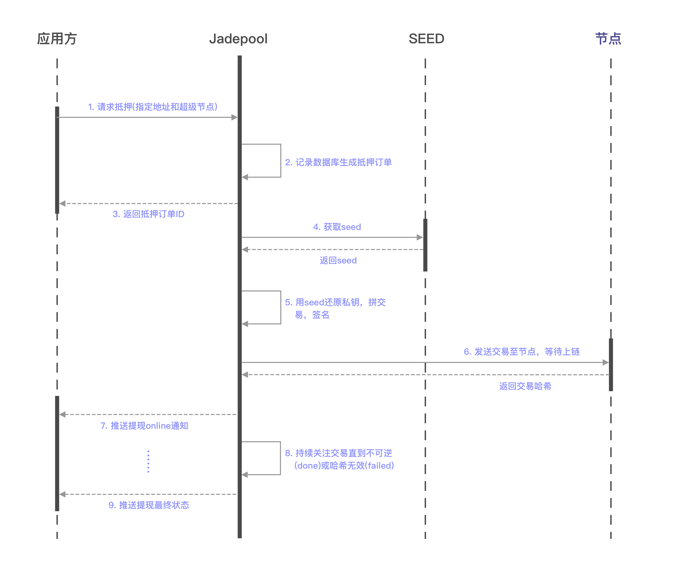
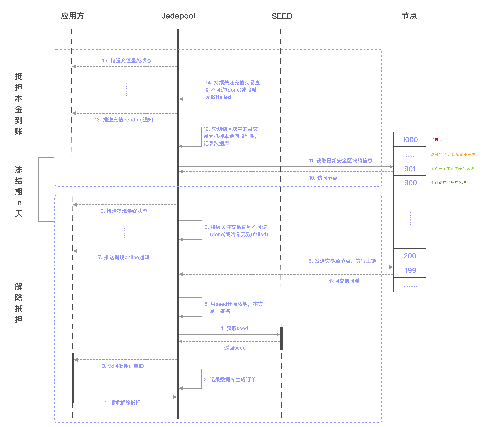

Jadepool Hub主要支持以下staking相关功能，更多细节请看[资源抵押API](https://nbltrust.github.io/jadepool-api-docs/#delegation)：

* 抵押资源：和提现流程类似，Jadepool Hub处理请求交易确认后即抵押成功。

* 解除抵押资源：Jadepool Hub发出undelegate请求流程和提现流程类似，冻结期结束后本金到账流程属于入账，和检测充值流程类似。

* 获取收益：Jadepool Hub发出claim reward请求流程和提现流程类似，收益到账流程属于入账，和检测充值流程类似。

 

下图是资源抵押流程图：

 

 

下图是解除资源抵押流程图：

 

