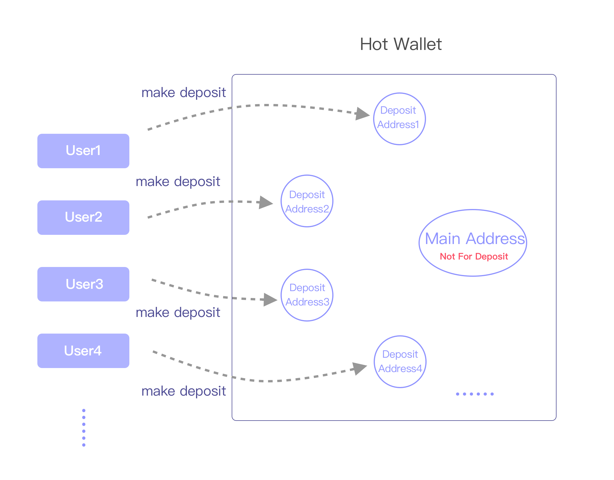
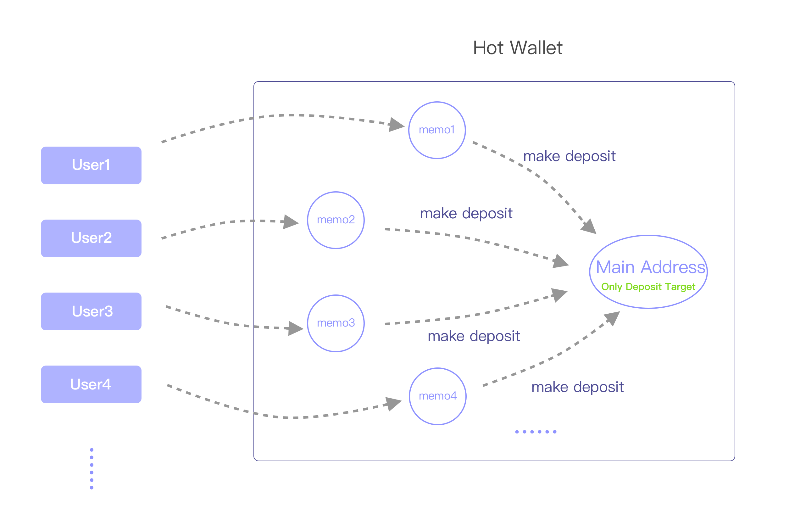

When client requests a new deposit address, it can be one of the following four modes: "auto", "deposit", "deposit_memo" and "normal". Depending on each blockchain's own characteristics, each has its default mode , either "deposit" or "deposit_memo". 

supported address mode | blockchain 
------ | ------- 
deposit | Bitcoin、Ethereum、ERC20、Omni(USDT)、Litecoin、Neo、VeChain、Qtum、Bitcoin Cash、Zcash、TomoChain、Tron、Kusama、Polkadot、Tezos、QLink、Algorand、Harmony
deposit_memo | EOS、Ripple、Stellar、Cybex、EveriToken
both | Cosmos、IRISnet、ChainX

**Note**：If client requests "auto", deposit addresses will be generated under the mode shown above (For Cosmos, IRISnet and ChainX, "auto" equals to "deposit_memo" in V1 API and to "deposit" in V2 API). If the requested mode is not supported then API will reject the request. For example, request "deposit" mode for EOS or request "deposit_memo" mode for Bitcoin.

### "Deposit" Mode
Client should generate a new deposit address (call Jadepool Hub API) for each user. The correspondence between the deposit address and the user’s account should be stored in the client's database. When Jadepool notifies client that the deposit address has received a transfer, it means that the balance of the corresponding user’s account should be increased. Jadepool is a pure wallet that do not store any user information. For security concerns, Jadepool will gather or break up the assets in the pool. So the balance of the user’s deposit address on the blockchain does not represent the user’s balance in the client's platform.

Deposit" Mode illustration:

### "Deposit_memo" Mode
Each hot wallet only has one deposit account/address. All users will be given the same deposit account/address but a different memo (or tag). Memo must be included in the deposit transaction and must be exactly the same.

"Deposit_memo" Mode illustration:

### "Normal" Mode
Jadepool Hub won't move assets in deposit addresses unless client requested through API. This mode gives client very much control over the assets flow in the hot wallet.

