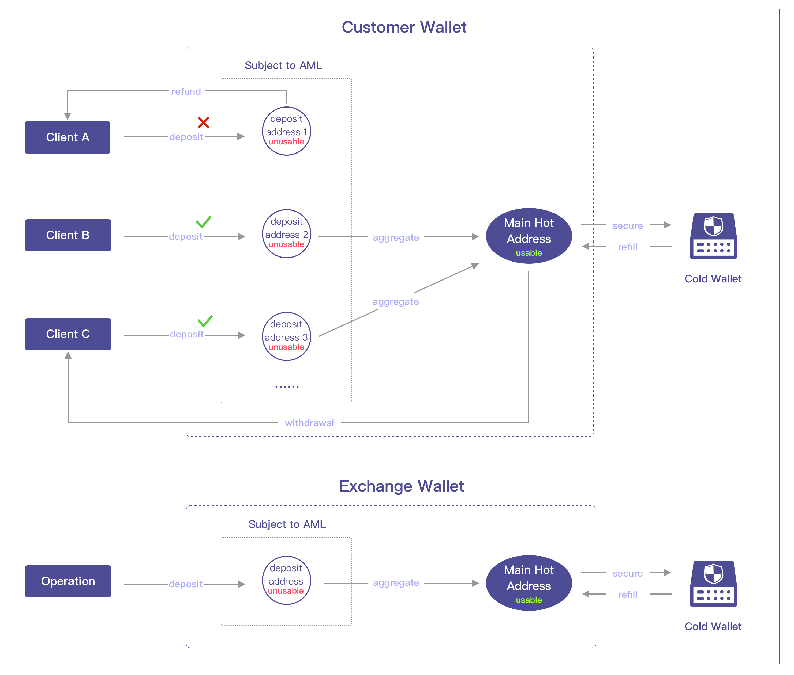

## 1. Overview
- A "Customer Wallet" needs to be created in Jadepool Hub, and all assets belong to C-end clients are stored in this wallet.
- A "Exchange Wallet" needs to be created in Jadepool Hub. This wallet is to pay transaction fees consumed by the "Customer Wallet" thus cannot be used for client deposit or withdrawal.
- Both "Exchange Wallet" and "Customer Wallet" contain three types of addresses: deposit address, main hot address and cold wallet address. 
- All deposit addresses in both wallets are subject to AML review. Only deposits that pass the AML check are allowed to be transferred to the main hot address. Otherwise, suspicious funds can either be refunded to an address outside of the custody system or stay put for further investigation.
- Each blockchain in each wallet has only one main hot address, which is mainly used to store approved assets and send transactions including withdrawal, cold storage and refund. 

## 2. Procedures
### 2.1 Deposit & Asset Isolation
Client can make deposits to the designated deposit address once completed KYC. 
Deposit address is the "buffer zone" to keep suspicious assets away from the hot wallet and the cold wallet. All assets made to deposit addresses must pass AML review before being transferred to the main hot address. Only then the deposited assets can become client's usable (withdrawal/tradable) balance.
AML review towards deposits are conducted by the exchange system. The detailed process is as follows:
1. Client makes a deposit to the designated deposit address.
2. Jadepool Hub detects the deposit transaction and creates an order and notifies the exchange system of the latest transaction status until it is finalized on the blockchain.
3. The exchange system conducts an AML check of this on-chain transaction once it reaches finalization.
4. Exchange system requests Jadepool Hub to aggregate the same amount of tokens that client deposited. If the transfer fails, the exchange system needs to make the same request again.
5. If the deposit fails to pass the AML review, the exchange system can choose either to transfer the suspicious assets outside of the hot wallet by requesting with a refund address or leave it there for further investigation.

### 2.2 Aggregation
Aggregation is the process of transferring deposited assets that pass the AML review to the main hot address. Outgoing transactions including client withdrawal and hot-to-cold transfer are sent only from the main hot address.
Each approved deposit will be aggregated to the main hot address by an individual transaction instead of mixed in one. For example:
1. Client makes two deposits. First deposit is 1 ETH and the second is 2 ETH.
2. The deposit address already has balance of 0.3 ETH which was pre-paid for fee.
3. The first deposit passes AML review.
4. The deposit address transfers 1 ETH to the main hot address and consumed fee of 0.1 ETH.
5. The second deposit passes AML review.
6. The deposit address transfers 2 ETH to the main hot address and consumed fee of 0.1 ETH.
7. There is still 0.1 ETH remaining in the deposit address left of the pre-paid fee.

### 2.3 Cold Storage
Assets in the deposit addresses are not considered safe and approved, thus the system determines the amount to transfer to the cold wallet only based on the balance in the main hot address. Whether the "Customer Wallet" or the "Exchange Wallet", the system operator can customize the risk control strategy for each token in each wallet to adjust the proportion of assets in the hot and cold wallet. They can adjust each token's settings "storage threshold" and "target balance", that is, when balance in the main hot address exceeds the threshold, some assets will be transferred to the cold wallet, and the remaining balance equals to the "target balance".

### 2.4 Withdrawal
The detailed process is as follows:
1. The exchange system makes a withdrawal request via API.
2. Jadepool Hub creates a withdrawal order and constructs transaction based on the withdrawal request and broadcasts the transaction to the blockchain.
3. Jadepool Hub notifies the transaction's latest status to the exchange system until the order reaches the final status.

### 2.5 Transaction Fee
For majority of blockchains, sending transaction consumes fee. However, the token consumed as fee is not necessarily the same token that clients deposit. Insufficient fee will cause inability to broadcast transaction. In this solution, all fees consumed by transactions in the "Customer Wallet" should be covered by the "Exchange Wallet".
The operator shall firstly make deposit to a deposit address in the "Exchange Wallet", wait for the deposit transaction finalized and passes the AML review then aggregated to the main hot address. Please note that this aggregation transaction also needs to consume fee thus the aggregated amount is less than the deposited amount. For instance, 0.1 ETH used as transaction fee out of the deposited 10 ETH and 9.9ETH aggregated. This only applies to the "Exchange Wallet".

#### 2.5.1 Bitcoin
A Bitcoin transaction can be associated with multiple inputs and outputs. It means the amount being sent can come from multiple Bitcoin addresses. Thus any transfer sent from the hot wallet system can directly use utxo belong to the main hot address of the "Exchange Wallet" to pay the transaction fee.
In order to avoid mixing assets belonging to clients and to exchange, the change utxo left of the transaction fee utxo will be returned to the same address which is the main hot address of the "Exchange Wallet".

There are two scenarios:
a. Aggregation/refund from the deposit address
i. Input 1 is the utxo (there may be more than one) with sufficient amount to pay the transaction fee in the main hot address of the "Exchange Wallet". After deducting the fee, it becomes a new utxo and then returned to the same address, which is the output 2 in the illustration below.
ii. The utxo deposited by the client is input 2, and it becomes the utxo in the main hot address of the "Client Wallet" after aggregation , or it becomes the utxo in the receiving address after the refund, which is the output 1 in the illustration.

b. Withdrawal/hot-to-cold transfer
i. Input 1 is the utxo (there may be more than one) in the main hot address of the "Exchange Wallet" that has sufficient amount to pay the transaction fee. After deducting the fee, it becomes a new utxo and then returned to the same address, which is output 3 in the illustration below.
ii. Input 2 is the selected utxo (there may be more than one) in the main hot address of the "Customer Wallet" for withdrawal or cold storage. After the transfer, it becomes a new utxo in the withdrawal receiving address or the cold wallet address which is the output 1 in the illustration.
iii. The input 2 might have some changes left. This change utxo will be directly returned to the same address, which is output 2 in the illustration.

#### 2.5.2 Ethereum
Ethereum is different from Bitcoin. It only allows one input and one output in a transaction. The transaction fee needs to be prepaid and transferred to the sender address before initiating any transfer. Therefore, the exchange system should call Jadepool Hub withdrawal API in advance to make transfers from the "Exchange Wallet" to the addresses in the "Customer Wallet" that lack fees, and the subsequent process can only be carried out after the fee is successfully replenished.

