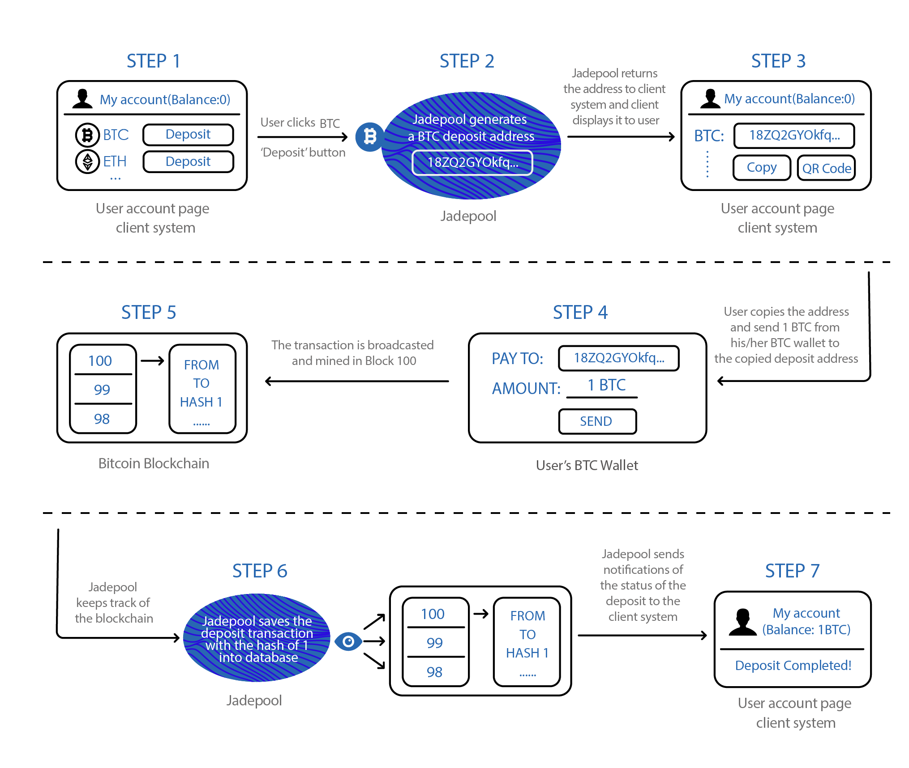

Deposit is one of the Jadepool main services。End user needs to obtain a deposit address through the client system and transfers asset from his / her own wallet to the address.

n order to support one blockchain, Jadepool must be configured with at least one node. With the node in sync with the chain, a scheduled task, whose interval settings can be customized, starts to scan all mined transactions in the new block and save any as “order” to database if the transaction should be accounted for. Considering the high possibility of temporary soft fork, every blockchain supported by Jadepool is configured with a “soft fork gap” setting in case Jadepool falsely saves transactions from invalid blocks, that means Jadepool only scans the block whose height is below the current block header minus the “soft fork gap”. Once the transaction is saved to database, Jadepool will keep track of it by querying transaction hash from node until it reaches the final state. No matter “done” or failed, Jadepool will make sure that the client system is informed. 

**Note:**
Some assets support "address mode", that is, each user gets a single deposit address. Some other assets support "memo mode", it means each user gets a deposit memo. Some assets support both "address mode" and "memo mode". Depending on different situations, each blockchain is assigned to a default address mode. Jadepool deposit address has the following four modes: auto, deposit, deposit_memo, normal. The following is the default deposit mode(auto) for crypto assets supported by Jadepool now:

 

Deposit Mode | Tokens | Address Mode
--------- | ------- | ------- 
address | BTC、ETH、ERC20、USDT、LTC、NEO、VET、QTUM | deposit
memo | EOS、CYB、XRP、XLM | deposit_memo
both | ATOM、IRIS | deposit or deposit_memo

 

If client requests a deposit address of "auto mode", the address will be generated according to the default mode in the above table (for ATOM and IRIS, if use v1 interface is used, the auto mode corresponds to “deposit_memo” mode, if use v2 interface, the auto mode corresponds to “deposit” mode). The request will be rejected if the address mode requested is not supported(API error).

 

- The “deposit” mode means client should generate a new deposit address for each user. The correspondence between the deposit address and the user’s account should be stored in the client's database. When Jadepool notifies client that the deposit address has received a transfer, it means that the balance of the corresponding user’s account should be increased. Jadepool is a pure wallet that do not store any user information. For security concerns, Jadepool will gather or break up the assets in the pool. So the balance of the user’s deposit address on the blockchain does not represent the user’s balance in the client's platform.

- The “deposit_memo” mode means all users' deposit accounts (addresses) are the same, but each user will be given a unique deposit memo (or tag). Memo should be included in the deposit transaction and is exactly the same. Jadepool keeps monitoring the deposit account and identifying deposits by memo and notifies client.

- The “normal” mode means that Jadepool will not move assets in deposit addresses unless told to by client. This mode is for delegation and Dapp functions that will be added in the future. Under “normal” mode, the delegation status and the Dapp asset status of the deposit address on blockchain represent the state of the user account on the client platform.

 

Deposit Illustration：

