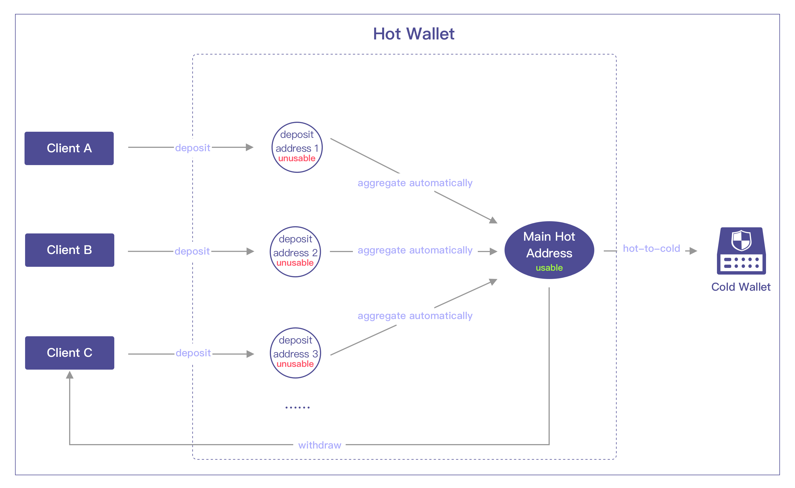
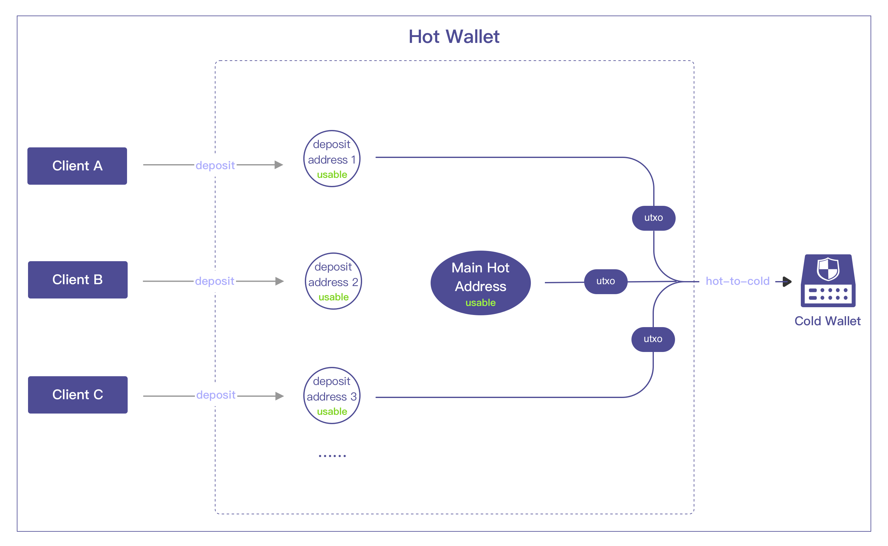
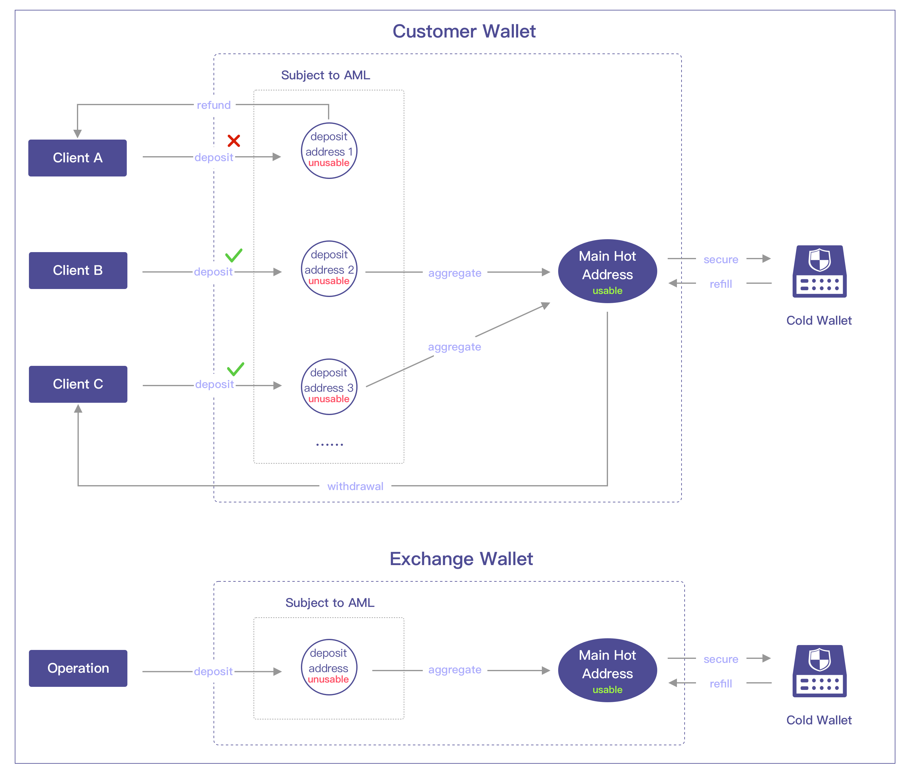
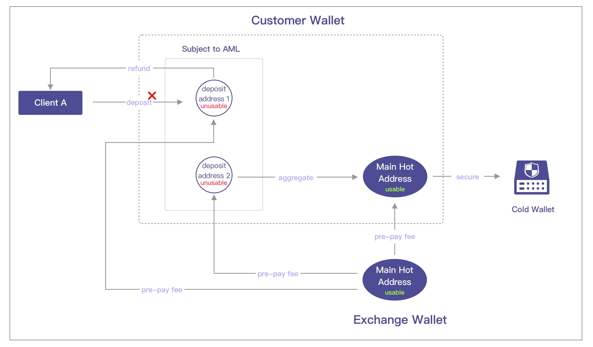
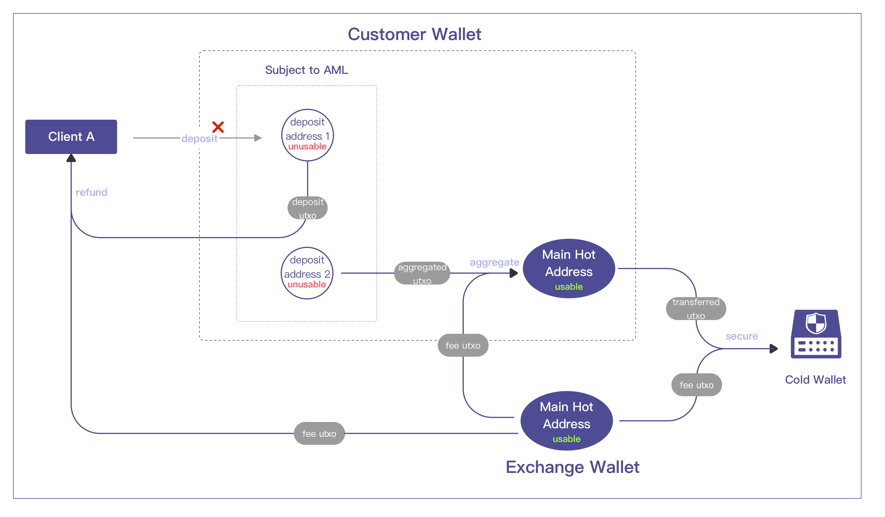

## 1.Normal
After the amount of assets in the deposit address exceeds a certain threshold, it will be automatically aggregated to the main address (not on utxo blockchains). 

ETH Illustration

BTC Illustration

## 2.Safe & AML
On the basis of the Normal mode, this mode adds the AML control on the deposit addresses. When deposit address receiving a deposit, the front-end system conducts an AML review of it and call the API to request assets aggregation to the main address only if it passes. 

Safe & AML Overview

ETH Illustration

BTC Illustration
