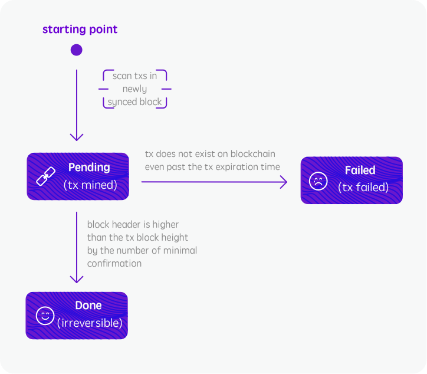
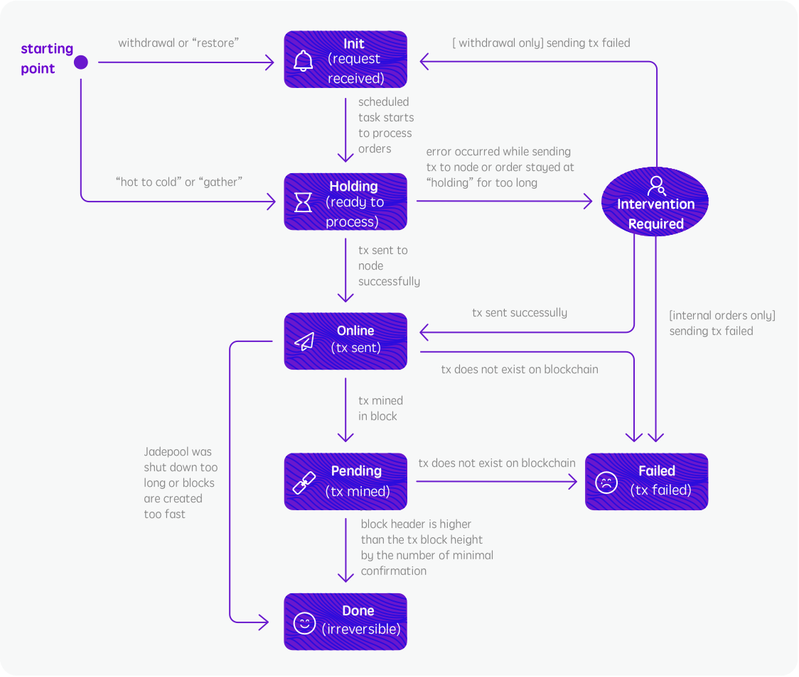

### Order Type
Type | Definition
--------- | ------- 
DEPOSIT | Transfers made to deposit addresses.
WITHDRAWAL | Requested by client to withdraw assets to a target address.
HOT-TO-COLD | Automatically triggered when balance is higher than the configured value.
COLD-TO-HOT | Transfers made from the cold wallet to the main address.
UNEXPECTED-IN | Transfers made directly to the main address from other than the cold wallet or transfers made to deposit addresses with mismatched memo.
AIRDROP | Transfers made from the configured airdrop addresses.
INTERNAL-OUT | Transfers made to internal addresses.
INTERNAL-IN | The order type that corresponds to “SWEEP INTERNAL” type.
SPECIAL-IN | Currently only used by NEO for claiming gas.
SYSTEM-CALL | The order type for certain blockchain behaviors. Types are listed below.
REVERT | The order type for reverting order of wrong type and generating correct order. For now this is only used for orders of RECHARGE_UNEXPECTED due to users putting wrong memo in deposit transaction.
REFUND | Refund order initiated from Admin interface regarding the UNEXPECTED-IN order.

 

SYSTEM_CALL | Definition
--------- | ------- 
UTXO_SCATTER | Transfers made among internal addresses for creating more utxo.
APPROVE | Deposit address authorizes the main address for using its tokens.

 

### Order State

State | Definition
--------- | ------- 
init | Jadepool Hub receives the client's request or automatically triggers an order but has not yet started processing. This state is for outgoing transfers only.
holding | The state before sending raw tx to node. Orders staying at 'holding' state for too long will be considered unusual and require manual processing. This state is for outgoing transfers only.
online | Raw transaction sent to node successfully. This state is for outgoing transfers only.
pending | Transaction mined in block and need more blocks produced for comfirmation.
done | Final state. Transaction has enough confirmations and is irreversible.
failed | Final state. Transaction failed to be mined.
cancelled | Order cancelled if system unable to process. For instance: balance not enough for HOT-TO-COLD transfer, duplicate order created for incoming transfer. Orders created by API by the front-end system won't be cancelled. Jadepool Hub does not send notifications for orders that are at cancelled status. 

 
Incoming transfer state machine Illustration:

 

 

Transfer-out state machine Illustration:

 

