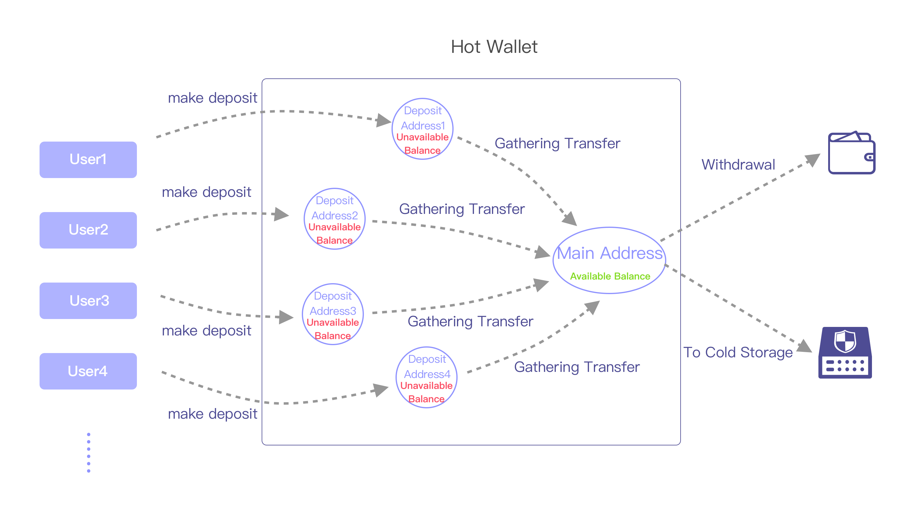

The transfer-out mode for each blockchain is fixed and cannot be edited.

 

address mode | transfer-out mode | blockchain 
--------- | --------- | -------  
deposit_memo | main account/address only | EOS、Ripple、Stellar、Cybex、EveriToken、Cosmos、IRISnet、ChainX
deposit | gathering + main account/address only | Ethereum、ERC20、Omni(USDT)、Neo、VeChain、Cosmos、IRISnet、TomoChain、Tron、Kusama、Polkadot、Tezos、QLink、Algorand、Harmony、ChainX
deposit | all addresses | Bitcoin、Litecoin、Qtum、Bitcoin Cash、Zcash

 

### Main account/address only
 

### Gathering + main account/address only
This mode is for assets that each user gets a unique deposit address. All tokens deposited by users will be gathered(transferred) to the main hot wallet address for easier address management. This is why the balance left in the deposit addresses are called the unavailable balance.
 

### All addresses can be used
This mode is for the utxo-like assets. The transaction model for these assets is m to n, that is, there can be more than one input and output in a transaction. Therefore, both the deposit addresses and the main hot wallet address can be included in the transaction inputs. The change will be sent to the main hot wallet address as a new utxo if there are left tokens after deducting the outputs value and the mining fee.
 

