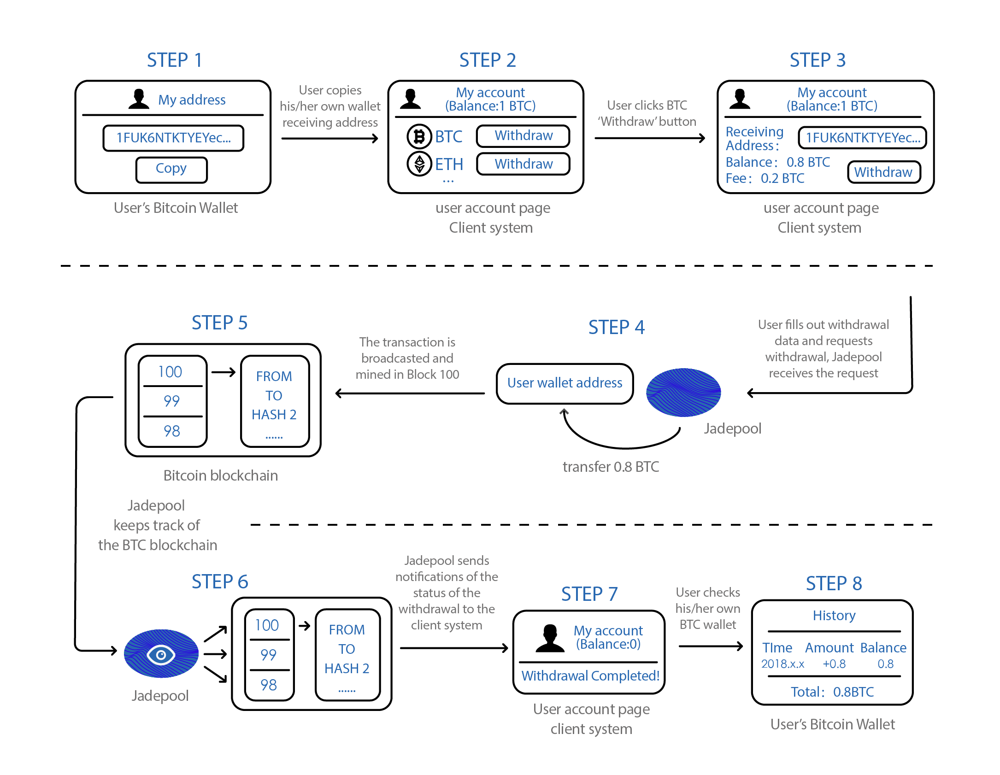

The amount that user can withdraw is always less than the assets stored at the client platform. It depends on the fee charged by the platform. Jadepool does not have any information about the fee deducted from the client's users. The fee collected from users deducting the mining fee paid by Jadepool is the client's profit. 

Upon withdrawal request, Jadepool will process and transfer the requested value to the user’ s address. Once the transaction is broadcasted and confirmed by the blockchain, Jadepool will inform the client of the withdrawal status. 

Jadepool supports three outgoing transfer modes. The mode for each supported blockchain is fixed and cannot be modified.

 

Outgoing Transfer Mode | Tokens
--------- | -------  
Main Hot Address only | EOS、CYB、XRP、XLM、ATOM、IRIS
Gather + Main Hot Address only | ETH、ERC20、USDT、NEO、VET、ATOM、IRIS
Any Address | BTC、LTC、QTUM

 

- Outgoing transfer only from the main hot wallet account: This mode is for the asset for which the wallet only has one deposit account and each user has one deposit memo. Such deposit account is called a main hot wallet account and all outgoing transfers are conducted from this account only.

- Gathering + Outgoing transfers from the main hot wallet address: This mode is for assets that each user gets a unique deposit address. All tokens deposited by customers(users) will be gathered to the main hot wallet address. This is why the balance left in the deposit addresses are called the unavailable balance.

- Outgoing transfers from both the deposit addresses and the main hot wallet address: This mode is for the utxo-like assets. The transaction mode for these assets is m to n, that is, there can be more than one input and output in a transaction. Therefore, both the deposit addresses and the main hot wallet address can be included in the transaction inputs. The change will be sent to the main hot wallet address as a new utxo if there are left tokens after deducting the outputs value and the mining fee.

 

Withdrawal Process Illustration:

