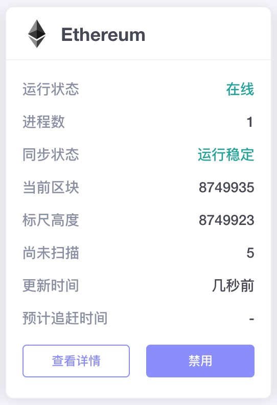

### 以启用Ethereum链为例

1. 安装部署节点。建议Jadepool Hub连接的所有节点都和Jadepool Hub部署在一个局域网内。

2. 进入“高级管理” -> “区块链管理”页面，点击Ethereum链的“查看详情”按钮，然后点击“区块链配置”栏，然后在“节点配置”修改节点IP地址。注意：“通用配置”下的“完成订单最小确认数”和“失败订单确认数”不需要修改，使用默认配置即可。

3. 对Ethereum链点击“启用”。（新版本里会弹窗可以选择开启该区块链的钱包）

4. 进入“高级管理” -> “进程管理”页面，选择机器并添加Ethereum链的进程。

5. 如果在启用区块链时没有选择需要开启该区块链的钱包，则进入钱包在“区块链&代币”页面中手动开启。

6. Ethereum链成功开启后，如下图所示。

