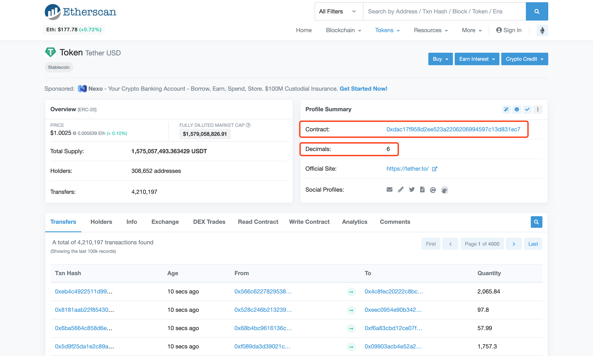

### 以添加ERC20 token为例

1. 进入Admin管理系统，前往“高级管理” -> “代币管理页面”。点击右上角的“添加代币”按钮。

2. “区块链”选择“Ethereum”（前提是Ethereum链已开启），“币种类型”选择“ERC20”。

3. 对于“代币名称”，不能使用和现在已开启的代币名称一样的名字，如果另一个代币已被禁用下架也不建议使用相同名称，因为会造成两个代币的订单数据混在一起。以USDT为例，如果开启过Bitcoin链的USDT，上架ERC20的USDT不要使用USDT这个名称。

4. 前往[etherscan](https://etherscan.io/)，搜索想上架的代币。以USDT为例，搜索找到代币合约的页面，如下图所示。

5. 上图中红色圈出的“Contract”即代币的智能合约地址，“Decimals”即代币的精度，分别将两个值填在“合约地址”和“精度”两个地方。

6. 最后按照运营需求调整其他参数，点击保存。

7. 此时列表会出现新添加的代币，但是处于禁用状态。点击列表中代币那一行，在右侧窗口点击滑动按钮开启代币。

8. 此时系统已上架该代币，最后进入想使用该代币的热钱包下的“区块链 & 代币”页面，开启代币。