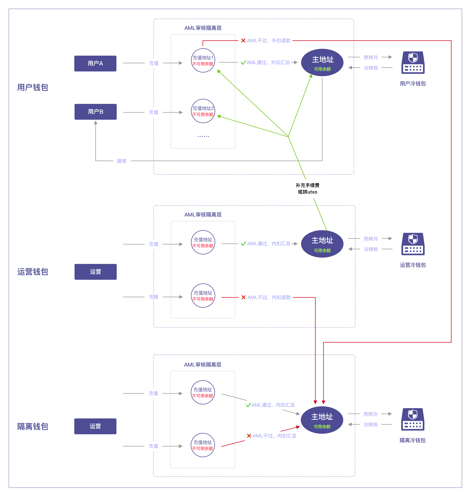
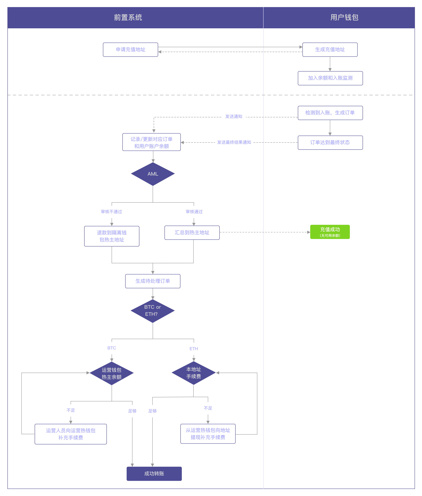
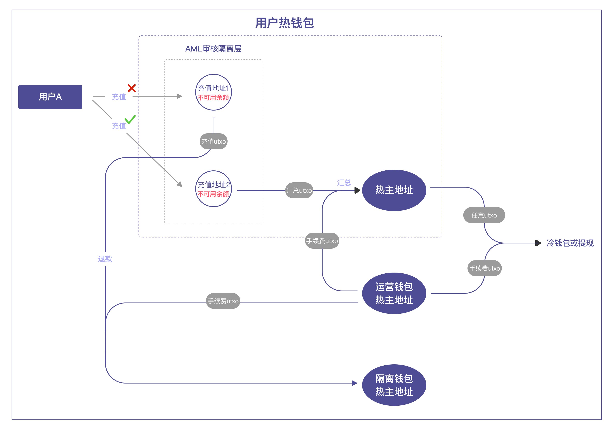
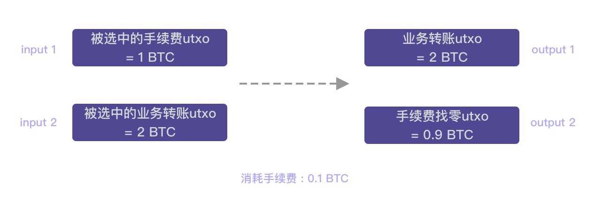
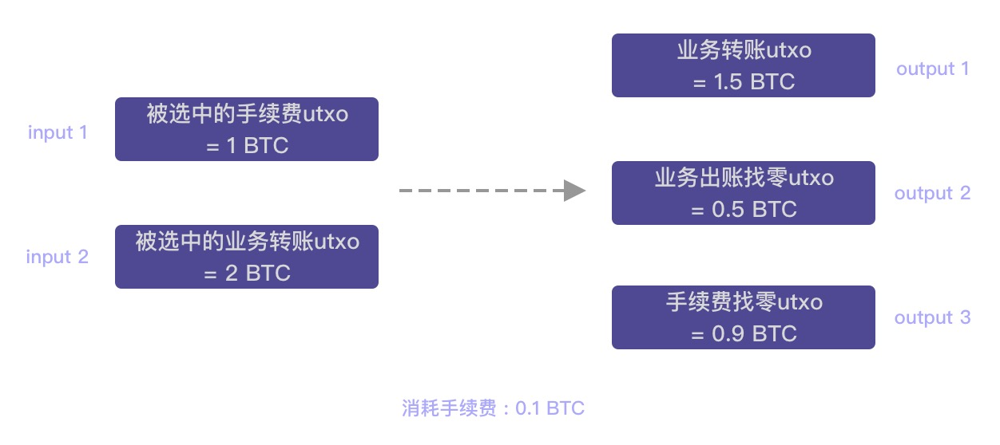
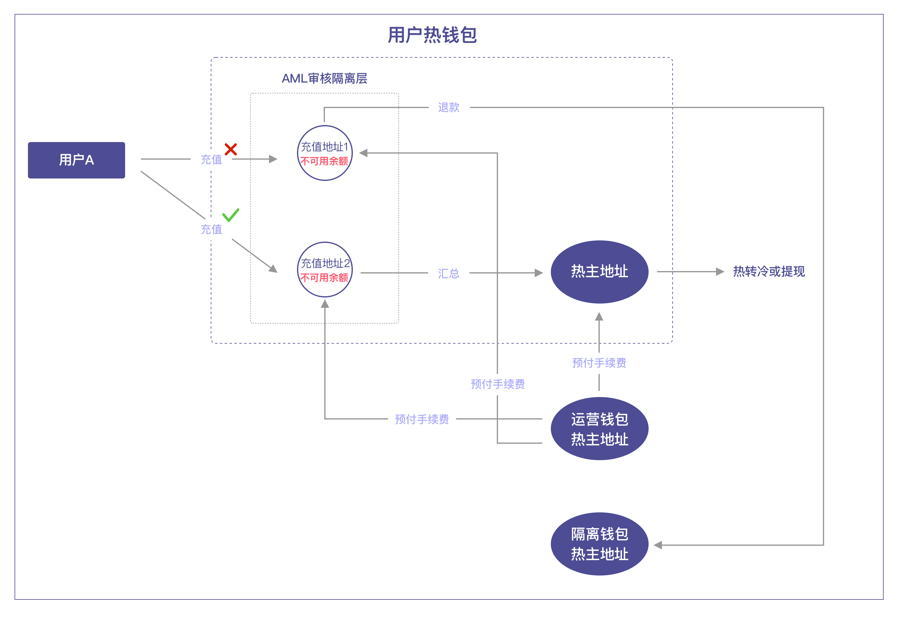

## 1.需求
1. 所有进入托管的资金都需要通过AML审核，通过前置系统审核的资金成为可信任资金。没有通过审核的资金都需要被转移到隔离钱包，或转移出托管。
2. 所有用户资产可混合在同一热钱包中，但需和运营资产和可疑资金分开。
3. 任何热钱包内存储的可信任资产只要超过一定（配置）金额就会将一部分自动安全转移到冷钱包。

## 2.方案简述
1. 运营人员手动在Jadepool创建“用户热钱包”，所有C端用户的资产都存储在该钱包。
2. 运营人员手动在Jadepool创建“运营热钱包”，该钱包承担手续费或结算，不给用户直接使用。
3. 运营人员手动在Jadepool创建“隔离热钱包”，该钱包存储用户钱包、运营钱包、隔离钱包的所有AML不通过的资产，不给用户直接使用。
4. 三类热钱包中的地址类型分两层：充值地址、热主地址。
5. 所有充值地址都属于AML隔离层，充值经过AML审核后才能向主地址转移。没有通过审核的资金前置系统可指定隔离钱包的热主地址进行退款，或暂时不作任何处理将资金留在地址内。
6. 钱包中的每个区块链只有一个热主地址，主要用于储存审核通过的资产、对外出账，不提供给C端用户使用。
7. “用户钱包”、“运营钱包”、“隔离钱包”的每个区块链都需要配置专属冷钱包地址，用于热钱包向冷钱包作安全资产转移。

## 3.用户钱包流程
以下是用户钱包ETH充值和汇总流程示意图，承担手续费模块对于不同区块链不一样，详情请阅读“3.5 手续费”。

### 3.1 充值
充值地址在本质上都是“隔离地址”，作用是作为AML“待验证”资产和“已验证”资产的缓冲隔离区，经过前置系统的审核通过后才能继续成为用户可使用（提现）的资产。

进入到“隔离地址”的资产都必须经过AML审核，AML审核由前置系统进行。具体流程如下：
1. 用户向充值地址进行充值。
2. Jadepool扫描到充值并生成充值订单，同时向前置系统通知充值情况。
3. 充值订单达到“完成”状态后，前置系统对充值订单所对应的链上交易进行AML审核。
- 如果审核通过，前置系统通过传入订单ID调API的方式告知Jadepool系统，Jadepool会将充值订单所对应的金额单独汇总到钱包主地址。**如果汇总订单失败，前置系统需要再次发起汇总请求。**
- 如果审核不通过，前置系统可以选择不处理这笔资产，留在地址里。或者传入**隔离钱包的热主地址**。

整个前置系统和Jadepool的交互过程请参考[订单附加流程](biz-flow.html)。

### 3.2 汇总
汇总是前置系统在判断充值资产可信后，通过API通知Jadepool系统将隔离地址里的充值订单对应的资产金额转移到钱包热主地址。

为符合强监管场景，**汇总将采用单独汇总的形式，即每一个充值地址的每一笔通过AML审核的充值金额都会被单独的交易汇总到热主地址，且两笔充值金额不会被混在一起汇总**。并且消耗手续费的方式是**外扣**（本质上使用的是运营钱包的资金付手续费，但每个区块链使用的方式不一样，详情阅读下文。）举例：

##### 对两笔充值的汇总都手续费充足：
1. 用户充值两笔，充值1的金额是1 ETH，充值2的金额是2 ETH
2. 充值地址内含有事先补充的0.3 ETH作为手续费余额
3. 充值1通过AML
4. 充值地址发起向主地址的汇总订单，订单金额是1 ETH，消耗手续费0.1 ETH
5. 充值2通过AML
6. 充值地址发起向主地址的汇总订单，订单金额是2 ETH，消耗手续费0.1 ETH
7. 汇总完成，充值地址里还剩余0.1 ETH可作为手续费。

##### 只对一笔充值的汇总有手续费：
1. 用户充值两笔，充值1的金额是1 ETH，充值2的金额是2 ETH
2. 充值地址内含有事先补充的0.1 ETH作为手续费余额
3. 充值1通过AML
4. 充值地址发起向主地址的汇总订单，订单金额是1 ETH，消耗手续费0.1 ETH
5. 充值2通过AML
6. 充值地址发起向主地址的汇总订单，订单金额是2 ETH，手续费不足，订单停留在“未处理”状态。

##### 没有任何手续费：
1. 用户充值两笔，充值1的金额是1 ETH，充值2的金额是2 ETH
2. 充值1通过AML
4. 充值地址发起向主地址的汇总订单，订单金额是1 ETH，消耗手续费0.1 ETH，地址余额剩余1.9ETH
5. 充值2通过AML
6. 充值地址发起向主地址的汇总订单，订单金额是2 ETH，手续费和转账金额都不足，订单停留在“未处理”状态。

**以上描述对退款也适用。**

### 3.3 退款
1. 对充值AML审核不通过时，需要传入隔离钱包的热主地址发起退款。手续费外扣。也就是说最终实际退款的金额等于充值金额。
2. 如果外部地址直接向热主地址转账，生成“异常入账”订单，可以通过API或管理系统手动对订单进行退款，退款地址填写隔离钱包的热主地址。手续费外扣。也就是说申请退款的金额等于最终实际退款的金额。
3. 如果外部地址直接向冷钱包地址转账，生成“【冷】异常入账”订单，可以通过API或管理系统手动对订单进行退款，退款金额从热主地址出，退款地址填写隔离钱包的热主地址。手续费外扣。也就是说申请退款的金额等于最终实际退款的金额。

注意：
1. 对于BTC，异常入账的uxto是被锁的，该utxo只能被用作退款，这笔金额也会被划分为“不可用余额”。BTC的【冷】异常入账的utxo不会被锁，退款是从热主地址挑选合适的utxo，和提现一个道理。ETH没有锁机制。
2. 如果退款到系统内地址，只能是任意热钱包的热主地址。退款到外部地址没有限制。
3. 收到来自外部地址的转账生成RU，只能退款，对于BTC来说utxo上锁；收到来自内部地址的转账生成RU，禁止退款，可以提现或热转冷或回血，对于BTC来说utxo不上锁。

### 3.4 冷存储
该场景下，充值地址中的资产尚不属于安全资产，所以向冷存储转移的金额不包含充值地址中的余额，只考虑热主地址中的余额。向冷存储转移也只从热主地址出账。运营对每个钱包中的每个代币都可以自定义风控策略调整在冷热钱包资产的比例。

### 3.5 提现
用户的提现都只从“用户热钱包”的热主地址出账。流程如下：
1. 前置系统通过API请求提现。
2. Jadepool记录订单。
3. Jadepool根据提现请求构建交易，将交易发送上链。
4. 将订单（交易）状态通知给前置系统，直到订单到最终状态。
5. 若交易失败，前置系统需重新请求提现，**Jadepool系统不会自动重试**。

### 3.6 手续费模型
运营方应事先将用于手续费的资产通过“运营热钱包”的充值地址充入，通过AML，汇总到热主地址。

#### 3.6.1 Bitcoin
Bitcoin交易支持m - n的格式，所以：
1. Jadepool系统发出的任何转账，会直接使用“运营热钱包”主地址的utxo支付手续费。
2. 为使手续费和用户资产不混在一起，交易中产出的用作手续费的找零utxo会直接找回“运营热钱包”主地址，作为一个新的utxo，可以继续给下次支付手续费使用。
该场景下，“运营热钱包”主地址的余额就是剩余可用承担手续费的余额。

分两种情况：
 
a. 充值通过AML后向主地址汇总/向外部地址转出或退款
 
i. input 1是“运营热钱包”主地址的有足够金额支付手续费的utxo（有可能有多个），扣除交易手续费后成为一个新的utxo再回到主地址，即图中output 2。
 
ii. 用户充值的utxo即是图例中的input 2，汇总后成为“用户热钱包”主地址中的utxo，或退款后成为退款接收地址的utxo，即图例中的output 1。

b. 提现/热转冷
 
i. input 1是“运营热钱包”主地址的有足够金额支付手续费的utxo（有可能有多个），扣除交易手续费后成为一个新的utxo再回到主地址，即图中output 3。
 
ii. 为了提现或热转冷，在“用户热钱包”主地址中选取转出的utxo（有可能有多个）即图例中的input 2，转出后成为提现接收地址或冷钱包地址中的utxo，即图例中的output 1。
 
iii. 业务出账有可能也需要找零，这笔找零utxo会直接找回“用户钱包”主地址，即图例中的output 2。

#### 3.6.2 Ethereum
Ethereum是账户机制，交易格式是1 - 1。手续费需要被转移到地址中才能被使用。所以前置系统应提前调用Jadepool提现API，从“运营热钱包”向缺少手续费的“用户热钱包”的地址发起转账，手续费补充成功后方可进行后续流程。

## 4.运营和隔离钱包流程
运营钱包和隔离钱包在本质上都属于前置系统运营性质的钱包，不提供给用户使用的钱包。所以，这两个钱包内发生交易的手续费都由地址本身来承担。

### 4.1 充值
运营和隔离钱包的充值资产也都必须经过AML审核，AML审核由前置系统进行。流程和用户钱包一样。

### 4.2 汇总
运营钱包和隔离钱包的汇总交易的消耗手续费方式都是**内扣**。

##### 举例
1. 运营充值两笔，充值1的金额是1 ETH，充值2的金额是2 ETH
2. 充值1通过AML
4. 充值地址发起向主地址的汇总订单，订单金额是0.9 ETH，消耗手续费0.1 ETH
5. 充值2通过AML
6. 充值地址发起向主地址的汇总订单，订单金额是1.9 ETH，消耗手续费0.1 ETH

以上描述对退款也适用。

### 3.3 退款
1. 对充值AML审核不通过时，需要传入隔离钱包的热主地址发起退款。手续费**内扣**。也就是说最终实际退款的金额等于充值金额减去交易消耗的手续费。
2. 如果外部地址直接向热主地址转账，生成“异常入账”订单，可以通过API或管理系统手动对订单进行退款，退款地址填写隔离钱包的热主地址。手续费**内扣**。也就是说申请退款的金额减去交易消耗的手续费等于最终实际退款的金额。
3. 如果外部地址直接向冷钱包地址转账，生成“【冷】异常入账”订单，可以通过API或管理系统手动对订单进行退款，退款金额从热主地址出，退款地址填写隔离钱包的热主地址。手续费**外扣**。也就是说申请退款的金额等于最终实际退款的金额。

注意：
1. 对于BTC，异常入账的uxto是被锁的，该utxo只能被用作退款，这笔金额也会被划分为“不可用余额”。BTC的【冷】异常入账的utxo不会被锁，退款是从热主地址挑选合适的utxo，和提现一个道理。ETH没有锁机制。
2. 如果退款到系统内地址，只能是任意热钱包的热主地址。退款到外部地址没有限制。
3. 收到来自外部地址的转账生成RU，只能退款，对于BTC来说utxo上锁；收到来自内部地址的转账生成RU，禁止退款，可以提现或热转冷或回血，对于BTC来说utxo不上锁。

