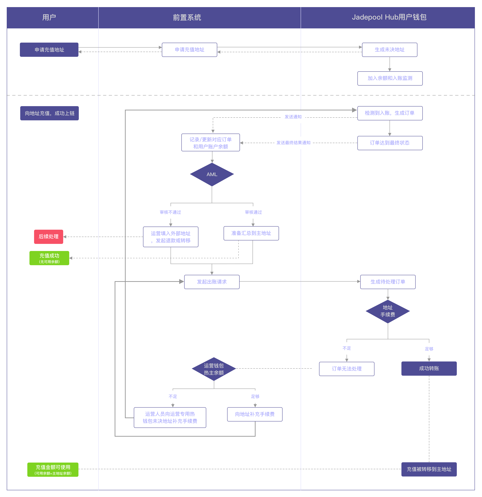

## 1.前置系统需求
1. 所有进入托管的资金都需要通过AML审核，通过前置系统审核的资金成为可信任资金。没有通过审核的资金需要退回，或暂时停留在地址。
2. 所有用户资产可混合在同一热钱包中，但需和运营资产分开。
3. 任何热钱包内存储的可信任资产只要超过一定（配置）金额就会将一部分自动安全转移到冷钱包。

Jadepool Hub系统，以下简称为Hub。

## 2.方案简述
1. 前置系统在Hub创建“用户热钱包”，所有C端用户都使用该钱包。
2. 前置系统在Hub创建“运营热钱包”，该钱包功能是承担手续费或结算，不给用户使用。
3. “用户热钱包”和“运营热钱包”的地址类型分两层：充值地址、主地址。
4. 使用“用户钱包”时，每个C端用户使用每个代币可以有一个或多个充值地址，由前置系统决定和记录。
5. “用户钱包”和“运营钱包”的充值地址都属于AML隔离层，充值经过AML审核后才能向主地址转移。没有通过审核的资金前置系统可指定接收地址转移出热钱包进行退款，或暂时不作任何处理将资金留在地址内。
6. 钱包中的每个区块链只有一个主地址，主要用于储存审核通过的资产、对外出账，不向C端用户提供充值使用。
7. “用户热钱包”和“运营热钱包”的每个区块链都需要配置专属冷钱包地址，用于热钱包向冷钱包作安全资产转移。

## 3.流程
以下是ETH充值和汇总流程示意图，承担手续费模块对于不同区块链不一样，详情请阅读“3.5 手续费”。

### 3.1 充值
用户在前置系统开户成功后，可以申请充值地址，并向地址进行充值。用户对每个代币拥有一个充值地址，或是对每个区块链拥有一个充值地址，Hub都支持，由前置系统产品设计决定。

#### 3.1.1 隔离地址
用户的充值地址在本质上都是“隔离地址”，作用是作为“待验证”资产和“已验证”资产的缓冲隔离区，其中储存的资产用户不可以直接使用，需要经过前置系统的AML审核。审核通过后才能继续成为用户可使用（提现）的资产。

#### 3.1.2 AML审核
进入到“隔离地址”的资产都必须经过AML审核，AML审核由前置系统进行。具体流程如下：
1. 用户向充值地址进行充值。
2. Hub扫描到充值并生成充值订单，同时向前置系统通知充值情况。
3. 充值订单达到“完成”状态后，前置系统对充值订单所对应的链上交易进行AML审核。
- 如果审核通过，前置系统通过传入订单ID调API的方式告知Hub系统，Hub会将充值订单所对应的金额单独汇总到钱包主地址。**如果汇总订单失败，前置系统需要再次发起汇总请求。**
- 如果审核不通过，前置系统可以选择不处理这笔资产，留在地址里。或者通过传入另一个地址，将可疑资产转移出钱包。

整个前置系统和Hub的交互过程请参考[订单附加流程](biz-flow.html)。

### 3.2 汇总
汇总是前置系统在判断充值资产可信后，通过API通知Hub系统将隔离地址里的充值订单对应的资产金额转移到钱包主地址的行为。

#### 3.2.1 主地址
经过AML审核通过后的资产都应该被汇总到主地址，主地址里的（来自用户充值的）资产对用户可用（具体金额和用户余额由前置系统控制）。用户提现、热转冷，都是从主地址出帐。

#### 3.2.2 汇总形式
为符合强监管场景，**汇总将采用单独汇总的形式，即每一个隔离地址的每一笔通过AML审核的充值金额都会被单独的交易汇总到热主地址，且两笔充值金额不会被混在一起汇总**，举例：
1. 用户充值两笔，充值1的金额是1 ETH，充值2的金额是2 ETH
2. 充值地址内含有事先补充的0.3 ETH作为手续费余额
3. 充值1通过AML
4. 充值地址发起向主地址的汇总交易，汇总金额是1 ETH，消耗手续费0.1 ETH
5. 充值2通过AML
6. 充值地址发起向主地址的汇总交易，汇总金额是2 ETH，消耗手续费0.1 ETH
7. 汇总完成，充值地址里还剩余0.1 ETH可作为手续费。

在手续费充足的情况下，一个隔离地址发起汇总的次数等于地址收到的的充值通过AML审核的次数。

### 3.3 冷存储
该场景下，隔离地址中的资产尚不属于安全资产，所以向冷存储转移的金额不包含隔离地址中的余额，只考虑主地址中的余额。向冷存储转移也只从主地址出账。
无论是对于“用户热钱包”还是“运营热钱包”，运营方对每个钱包中的每个代币都可以自定义风控策略调整在冷热钱包资产的比例。运营人员可以对热钱包里每个代币设置：
存储上限和目标余额，即热主地址超过该上限后就转一部分资产到冷钱包，热主地址剩余目标余额。

Hub系统只属于热钱包范围，冷钱包不属于Hub系统。运营方可选择任何冷钱包使用，最后只需将冷钱包地址配置在Hub所连接的Seed Vault程序中。当热钱包中资产不足应对提现，运营方需将冷钱包中资产转移到热钱包的主地址中。**此过程属于人工流程，不属于Hub产品范围，Hub不能替代运营方完成“冷转热”。**

### 3.4 提现
用户的提现都只从“用户热钱包”的主地址出账。流程如下：
1. 前置系统通过API请求提现。
2. Hub记录订单。
3. Hub根据提现请求构建交易，将交易发送上链。
4. 将订单（交易）状态通知给前置系统，直到订单到最终状态。
5. 若交易失败，前置系统需重新请求提现，**Hub系统不会自动重试**。

### 3.5 手续费
大部分区块链发送交易都需要支付手续费，但手续费币种不一定是用户使用产品时想充值的币种。所以任何地址都会出现交易因手续费不足而导致交易无法发送。根据需求，“用户热钱包”消耗的所有手续费都由“运营热钱包”承担。

运营方应事先将用于手续费的资产：
1. 通过“运营热钱包”的充值地址充入，通过AML，汇总到主地址
**注意：用作手续费的充值通过AML后汇总也需要手续费，所以这里的汇总的金额不等于充值的金额，其中有一部分要被用作汇总的手续费。例如：充值10ETH，汇总9.9ETH，0.1ETH用作汇总手续费。这种汇总方式只适用于被设置为“承担手续费钱包”的钱包。**
2. 或直接转入“运营热钱包”的主地址
这样就完成了“运营热钱包”承担手续费的前提：主地址有足够的金额用作手续费消耗。

#### 3.5.1 Bitcoin
Bitcoin交易支持m - n的格式，所以：
1. Hub系统发出的任何转账，会直接使用“运营热钱包”主地址的utxo支付手续费。
2. 为使手续费和用户资产不混在一起，交易中产出的用作手续费的找零utxo会直接找回“运营热钱包”主地址，作为一个新的utxo，可以继续给下次支付手续费使用。
该场景下，“运营热钱包”主地址的余额就是剩余可用承担手续费的余额。

分两种情况：
 
a. 充值通过AML后向主地址汇总/向外部地址转出或退款
 
i. input 1是“运营热钱包”主地址的有足够金额支付手续费的utxo（有可能有多个），扣除交易手续费后成为一个新的utxo再回到主地址，即图中output 2。
 
ii. 用户充值的utxo即是图例中的input 2，汇总后成为“用户热钱包”主地址中的utxo，或退款后成为退款接收地址的utxo，即图例中的output 1。

b. 提现/热转冷
 
i. input 1是“运营热钱包”主地址的有足够金额支付手续费的utxo（有可能有多个），扣除交易手续费后成为一个新的utxo再回到主地址，即图中output 3。
 
ii. 为了提现或热转冷，在“用户热钱包”主地址中选取转出的utxo（有可能有多个）即图例中的input 2，转出后成为提现接收地址或冷钱包地址中的utxo，即图例中的output 1。
 
iii. 业务出账有可能也需要找零，这笔找零utxo会直接找回“用户钱包”主地址，即图例中的output 2。

#### 3.5.2 Ethereum
Ethereum是账户机制，交易格式是1 - 1。手续费需要被转移到地址中才能被使用。所以前置系统应提前调用Hub提现API，从“运营热钱包”向缺少手续费的“用户热钱包”的地址发起转账，手续费补充成功后方可进行后续流程。

