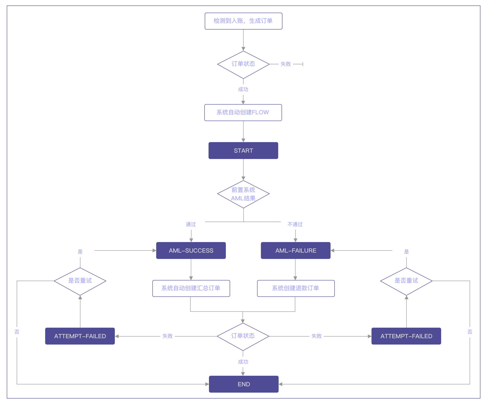

1. Hub扫描到充值订单，当订单状态变为done后系统会自动创建bizFlow流程，bizFlow的初始状态为START。如果充值订单失败了则不会创建bizFlow。同时，Hub会将充值订单的信息通知到前置系统。

2. 前置系统对充值进行AML审核：

如果AML审核通过，调用“处理订单附加流程”API，传入passed=true，代表AML通过，可以将资产汇总到主地址。此时bizFlow状态变更为AML-SUCCESS。Hub系统会自动创建汇总订单。汇总订单的信息也会以回调方式通知前置系统。

	a. 如果汇总订单成功：bizFlow状态更新为END，流程结束，无法再变更
	b. 如果汇总订单失败：bizFlow状态更新为ATTEMPT-FAILED，可重新调用“处理订单附加流程”API申请重试汇总或者放弃汇总直接结束流程。分以下两种情况：

		i. retry=true，即重试汇总，bizFlow状态更新为AML-SUCCESS，Hub重新创建汇总订单，再次进入上述a或b流程
        ii. retry=false，即放弃汇总，bizFlow状态更新为END，流程结束，无法再变更

如果AML审核没通过，调用“处理订单附加流程”API，传入passed=false，必须同时传入需要将可疑资金转移到的目标地址，订单bizFlow状态更新为AML-FAILURE，Hub系统会自动创建退款订单。

**注意：**如果暂时不想处理可疑资金，可以将资金继续放在充值地址里，直到有了转移地址后再调用API进行转出。在此之前，bizFlow的状态会一直处于START。

	a. 如果退款订单成功：bizFlow状态更新为END，流程结束，无法再变更
	b. 如果退款订单失败：bizFlow状态更新为ATTEMPT-FAILED，可重新调用“处理订单附加流程”API申请重试退款或者放弃退款直接结束流程。分以下两种情况：

		i. retry=true，即重试退款，bizFlow状态更新为AML-FAILURE，Hub重新创建退款订单，进入上述a或b流程
		ii. retry=false，即放弃退款，bizFlow状态更新为END，流程结束，无法再变更
