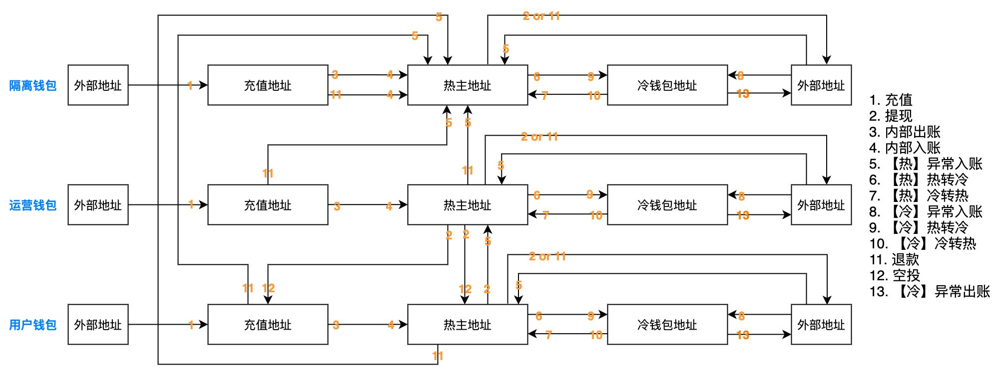

额外总结和corner case的补充说明：
- A钱包的热主地址转账到B钱包的充值地址，A钱包只可能是提现，B钱包生成充值。除非A钱包是safe运营钱包，B钱包是safe用户钱包，B生成空投。
- A钱包的热主地址转账到B钱包的热主地址，A钱包可能是提现或退款，B钱包生成异常入账。除非A钱包是safe运营钱包，B钱包是safe用户钱包，B生成空投。
- A钱包的热主地址转账到B钱包的冷钱包地址，A钱包只可能是提现，B钱包生成【冷】异常入账。
- A钱包的冷钱包地址转账到B钱包的充值地址，A钱包生成【冷】异常转出，B钱包生成充值。
- A钱包的冷钱包地址转账到B钱包的热主地址，A钱包生成【冷】异常转出，B钱包生成异常入账。
- A钱包的冷钱包地址转账到B钱包的冷钱包地址，A钱包生成【冷】异常出账，B钱包生成【冷】异常入账。
- A钱包的充值地址转账到B钱包的充值地址，不应该发生。
- A钱包的充值地址转账到B钱包的热主地址，A钱包是退款，B钱包生成异常入账。
- A钱包的充值地址转账到B钱包的冷钱包地址，不应该发生。
- A钱包的冷钱包地址转账到A钱包的充值地址，A钱包生成【冷】异常出账和内部入账。
- A钱包的冷钱包地址转账到A钱包的热主地址，A钱包生成【冷】冷转热和【热】冷转热。
- A钱包的充值地址转账到A钱包的充值地址，不应该发生。
- A钱包的充值地址转账到A钱包的热主地址，A钱包生成内部出账和内部入账。
- A钱包的充值地址转账到A钱包的冷钱包地址，不应该发生。
- A钱包的热主地址转账到A钱包的冷钱包地址，A钱包生成【热】热转冷和【冷】热转冷。
- A钱包的热主地址转账到A钱包的充值地址，A钱包生成内部出账和内部入账（授权生成SYSTEM CALL）。
- 如果向隔离钱包或运营钱包的充值地址转账ERC20，不应该这样操作，但如果做了，同钱包的热主地址会向充值地址转账ETH，然后充值地址授权ERC20，最后ERC20被汇总或退款。
