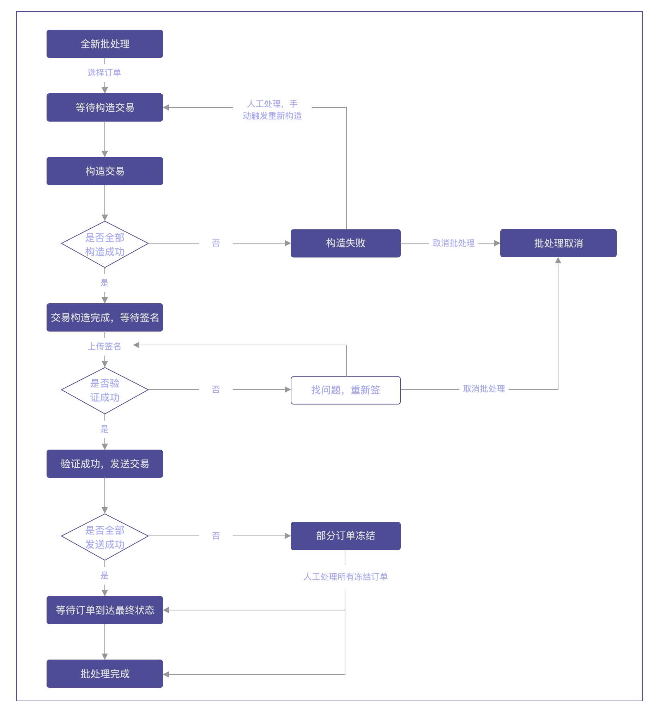

为使系统管理员更加方便高效地处理离线钱包出账交易，Jadepool Hub提供冷签名批处理功能，可实现批量下载、导出、签名和上传。冷签名批处理功能只能处理离线签名模式钱包的订单。目前只支持Ethereum链。

## 使用前注意事项:
- 保证Jadepool Hub系统正常运行
- 保证jadepool-biz-monitor进程正常运行
- 保证需要使用离线签名功能的区块链进程正常运行
- 保证发交易的地址存有足够手续费和余额

## 批处理使用流程:

## 批处理使用流程:
1. 登陆Admin系统，前往“运营”->“冷签名批处理”页面。
2. 点击“创建批处理”按钮，进入创建页面。
3. 选择区块链，然后勾选需要冷签名处理的订单，勾选完毕后点击确认。**注意：一条区块链同一时间只能存在一个未完结的批处理，否则批处理会创建失败。**
4. 批处理创建成功后，如果勾选“自动构建交易”，会自动开始构建交易。如果不勾选，需要手动操作触发。
5. 构建成功后，可下载未签名交易的json文件。如果构建失败，可以前往batch详情筛选出有问题的订单并查看报错信息。人工处理完成后，可对批处理手动操作“构建未签名交易”。
6. 将未签名交易的json文件拷贝到部署“离线签名服务”的机器上。
7. 使用离线签名服务进行签名。步骤教程请阅读下文。
8. 签名完成后，将json文件拷贝到Jadepool Hub所在服务器，在页面对批处理点击“上传签名”
9. 上传成功后，系统会自动发送交易到节点。**注意：如果交易发送时报错，会造成订单冻结，阅读下文异常处理模块了解更多。**
10. 等待所有订单到达最终状态。**注意：如果交易长时间无法确认状态，阅读下文异常处理模块了解更多。**批处理里的所有订单状态必须达到“处理完成”或“处理完成”，批处理才能达到完结状态，才能开启下一个新批处理。

## 离线签名程序使用流程:
**注意：离线签名程序只能在Mac电脑使用**

1. 首次使用cold-signer，需要初始化设置管理员密码，建议设置足够复杂的密码并将其备份。
2. 启动js-signer进程：
``
pm2 start js-signer/json-rpc-svr.js
``
3. 将未签名交易文件拷贝到signer所在目录下
4. 替换json文件名，运行以下命令进行签名：
``
./signer --sign batch_A1B2C3D4_20200620_unsigned.json
``
5. 程序签名完成后，会自动在程序所在目录生成文件，例如batch_A1B2C3D4_20200620_signed.json

## 状态介绍:
批处理状态| EN | 说明
---------| ------- | ------- 
新建 | NEW | 批处理被成功创建，可以对订单构造未签名交易。
构造交易中 | BUILDING TX | 正在对批处理中订单进行构建交易。
构造交易异常 | BLOCKED | 批处理中有订单构建未签名交易失败。可前往二级页面批处理详情查看详细报错信息。
等待签名 | READY FOR SIGNATURE | 批处理中的所有订单的未签名交易都已构建成功，可以下载.json文件。
签名异常 | SIGNATURE ERROR | 签名文件部分损坏，上传的数据不完整或验证哈希失败。
发送交易中 | SENDING TX | 系统正在向节点发送交易。
交易状态异常 | PROCESS EXCEPTION | 批处理中任何一个订单处于“发送交易报错”或“无法确定”的状态，需要人工介入处理。
等待订单完成 | IN PROCESS | 等待批处理中的订单全部达到最终状态（“处理成功”或“处理失败”）。
完结 | CLOSED | 批处理中的所有订单都达到最终状态（“处理成功”或“处理失败”）。
取消 | CANCELLED | 批处理被取消，签名上传成功后不能操作取消批处理。

批处理内订单状态 | EN | 说明
--------- | ------- | ------- 
等待处理 | SELECTED | 等待系统对订单构造未签名交易。
构造成功 | TX BUILT | 订单的未签名交易已构造成功。
构造失败 | BUILD ERROR | 订单的未签名交易构造失败，需要人为介入调查。
签名已上传 | SIGNATURE READY | 该订单已得到签名，可以构造签名交易。
准备发送 | READY TO SEND | 构造签名交易，等待发送上链。
无法确定 | LINGERING | 交易处于系统无法在节点找到但又不能断定交易已失败。
等待重发 | READY TO RESEND | 订单可重发，等待手动触发系统统一重发。
正在发送 | SENDING | 系统正在尝试发送交易。
等待确认 | CONFIRMING | 交易已成功发送到节点，交易等待被打包或等待更多区块确认。
发送交易报错 | BROADCAST ERROR | 向节点发送交易时节点报错，需要人工介入在批处理二级页面对单条订单处理。
处理成功 | DISBURSED | 完成前置系统的请求，出账成功，对应订单的“完成”状态。
处理失败 | DISBURSEMENT FAILED | 没有完成前置系统的请求，出账失败，包含订单的“失败”和“未处理”状态。如果人工处理“冻结”订单选择“重新处理”，订单会处于“未处理”状态。“未处理”状态的订单不能再在当前批处理中被处理，需新建批处理勾选订单进行处理。

## 异常处理:
当批处理处于“交易状态异常”，说明批处理中有至少一个订单处于“发送交易报错”或“无法确定”的状态，需要人工介入处理。必须将批处理中所有异常订单都处理完成后，批处理的状态机才能继续走下去。

### 发送交易报错 | BROADCAST ERROR

“发送交易报错”状态说明系统在发送交易时遇到节点报错。

处理方式：
1. 如果订单有（计算得出的）哈希，点击哈希跳转到区块链浏览器查看交易是否成功上链。如果没有，需要运营人员前往浏览器寻找。
2. 订单行会出现“异常处理”按钮，点击后出现处理弹窗。
3. 处理方案有以下两种：
	a. 如果交易上链（无论智能合约是否执行成功），点击“上链成功”，(如果没有计算哈希)填入哈希和交易所在区块号。
	b. 如果交易没有上链，点击“上链失败”：
		 i. 重新发送：如果是节点出问题而导致的发送失败，选择此方案。
		ii. 重新构建：如果是因为签名错误或者gas limit/price等交易相关设置过低而导致的发送失败，也就是无论重新发送多少次都不会成功的原因，需要选择此方案。

4. 点击确认后，订单状态会变为“等待重发”。

### 无法确定 | LINGERING

“无法确定”状态说明系统无法在节点找到交易但又不能断定交易肯定失败。以Ethereum举例，此状态代表系统无法在节点找到交易但nonce未被其他交易占用。

处理方式：
1. 批处理二级页面会出现警告提示，点击提示中“一键检查”按钮。此时系统会检查所有订单。
2. 弹窗会显示“仍然不能被确定”和“可以被确定”的订单分别有几个，也可以点击查看分别是哪些订单。
3. 对弹窗点击确认，系统将重新发送在节点没有明确信息的交易，并对有明确信息的交易继续确认状态。需要重发的订单状态会变为“等待重发”。

**注意**：
如果因为节点问题导致的订单状态不正确，请修复好节点后再进行异常处理。

当批处理内的所有异常都被处理后，如果有“等待重发”状态的订单，二级页面会出现提示，点击“重新发送”按钮，系统会重发所有“等待重发”的订单。

