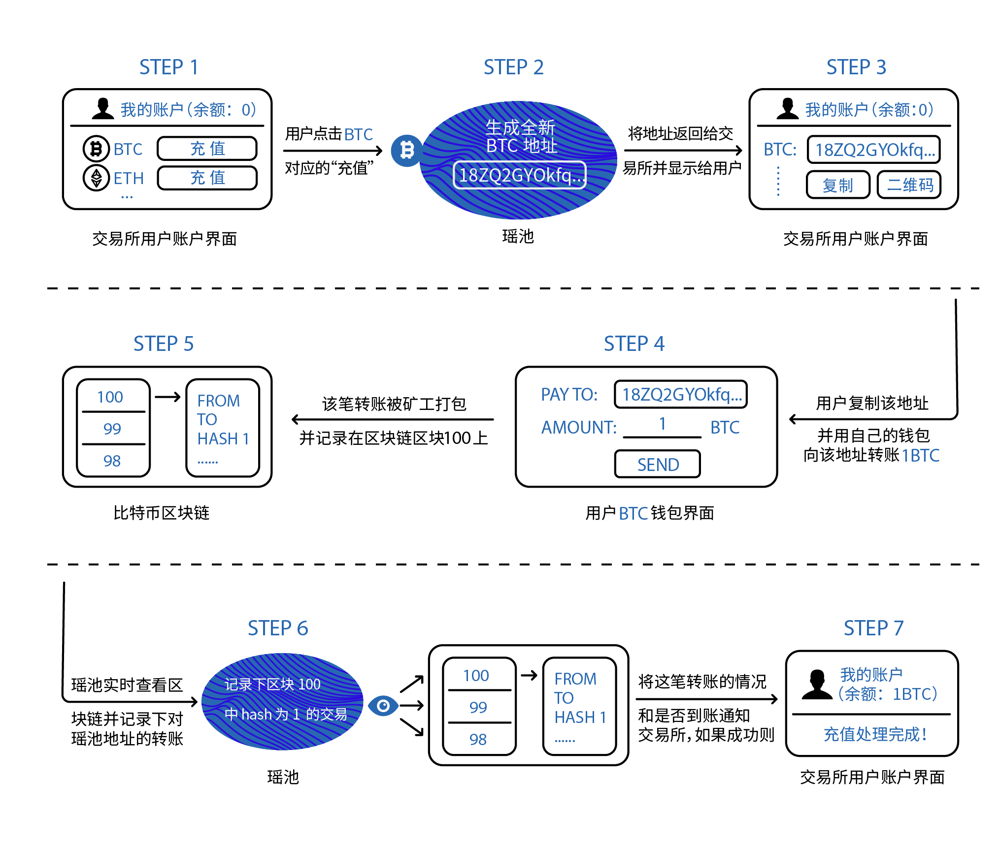

充值是Jadepool Hub Hub的重要业务之一。用户只需要在Jadepool Hub Hub获取一个欲充值币种的地址，然后用自己的钱包向该地址转账或者从平台提现。

在Jadepool Hub Hub系统中启动的每条区块链都需要配置节点，随着节点不断和链的最高区块同步，Jadepool Hub Hub会通过扫描节点最新同步到的区块中被打包的每笔交易进行判断，然后根据不同情况区分转账类型并将交易的信息以订单形式存储数据库。考虑到区块链的分叉可能性，Jadepool Hub Hub为防止错误记录分叉期弱势链上的交易，对每个链都设置了符合该链情况的“防分叉检测间隔”参数。换言之，Jadepool Hub Hub只扫描当前最高区块头减去“防分叉检测间隔参数”的高度以下的区块。交易被记录进数据库后，Jadepool Hub Hub会一直跟踪交易直到最终状态，也就是向节点查询交易哈希以确保交易仍然在链上有效并且最终不可逆，最终无论交易成功或失败，Jadepool Hub Hub都会保证将状态以回调的形式通知客户。若Jadepool Hub Hub没有成功记录入账交易，客户仍可以通过“重新扫描区块”的方式再次扫描区块。

**注意：**
有些区块链支持多地址模式，即每个用户拥有一个充值地址，例如BTC、ETH等。
有些资产支持钱包只有一个充值地址（帐户），每个用户拥有一个充值memo，例如EOS。
有些资产既支持多地址模式也支持memo模式，例如COSMOS。
根据不同情况，每个区块链都有默认的地址模式。当应用方请求生成充值地址时，Jadepool Hub地址分为四种模式：**auto**, **deposit**, **deposit_memo**, **normal**。以下是Jadepool Hub现已支持资产的默认充值模式（auto）：

 

模式 | 币种 | 支持地址模式
--------- | ------- | ------- 
多地址模式 | BTC、ETH、ERC20、USDT、LTC、NEO、VET、QTUM | deposit
memo模式 | EOS、CYB、XRP、XLM | deposit_memo
都支持 | ATOM、IRIS | deposit 或者 deposit_memo

 

应用方请求生成充值地址的模式如果是auto，即地址按照上表默认模式生成（对于ATOM、IRIS来说，如果使用v1接口，auto对应deposit_memo模式，使用v2接口auto对应deposit模式），如果区块链不支持应用方要求的地址模式则会拒绝请求(API报错)。

 

- 对于deposit模式，应用方应为每个用户生成一个充值地址，充值地址和用户的对应关系应存储在应用方数据库中，当Jadepool Hub通知应用方该充值地址接收到充值时，代表该用户账户充值。Jadepool Hub只是单纯的钱包，没有任何用户的信息，为安全因素和方便资产管理考虑，Jadepool Hub会在资金池中进行资产汇总或打散，所以用户的充值地址在区块链上的余额并不代表用户在应用方系统的余额。

- 对于deposit_memo模式，所有C端用户的充值帐户(地址)都是一样的，但每个用户会拥有独一无二的充值memo(备注或标签)，memo可以被包含在区块链交易中，所以Jadepool Hub通过监控一个充值帐户和识别不同memo从而通知应用方，应用方通过用户和memo的对应关系而判断充值用户。

- normal模式是指，Jadepool Hub不会自发挪用充值地址的资产，所有行为都要应用方主动触发，该场景针对抵押和未来会新增的Dapp功能。在normal模式下，充值地址的抵押状态和Dapp资产状态代表用户在应用方的状态。

 

下图是模拟交易所使用Jadepool Hub场景为例的充值流程图：

