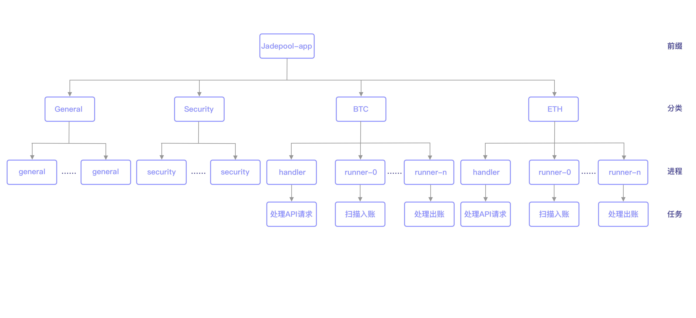

该架构下，每类进程在pm2都可以启动多个。例如pm2 list：
 
Jadepool-app-general
 
Jadepool-app-general
 
Jadepool-app-security
 
Jadepool-app-security
 
Jadepool-app-BTC-handler
 
Jadepool-app-BTC-runner-0
 
Jadepool-app-BTC-runner-0
 
Jadepool-app-BTC-runner-1
 
Jadepool-app-ETH-handler
 
Jadepool-app-ETH-handler
 
Jadepool-app-ETH-runner-0
 
Jadepool-app-ETH-runner-1
 
Jadepool-app-ETH-runner-1
 

##### Jadepool-app-general
负责处理一般任务的进程，例如生成回调和发送回调。

##### Jadepool-app-security
负责安全相关任务的进程。

##### Jadepool-app-xxx-handler
负责处理来自jadepool-api请求的进程。

##### Jadepool-app-xxx-runner
负责处理指定区块链相关任务的进程，一个区块链可以有多个runner且每个runner的任务类别不一样，可以对runner指定处理任务类别，比如ETH-runner-0处理ETH扫描区块任务，ETH-runner-1处理出账任务。

