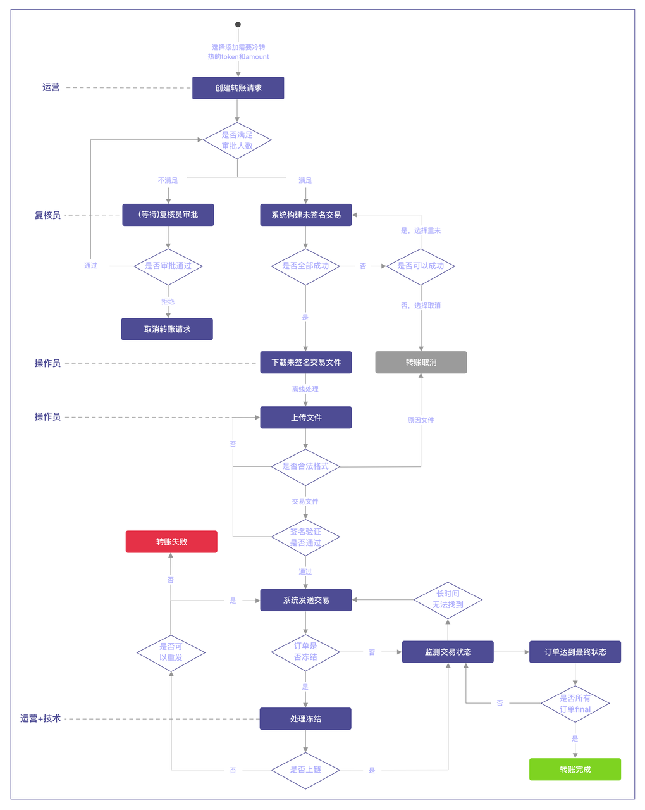

## 1. 需求背景

1. 瑶池作为在线热钱包，对应使用的冷钱包需要是纯离线air-gap的。
2. 冷钱包向热钱包的转账需要多人审批。
3. 冷钱包需要使用HSM，由HSM生成地址和交易签名。

## 2.方案简述

1. HCS在冷钱包方案里的作用是构造未签名交易、向节点广播交易、监控交易状态，而不参与任何签名相关的事务。
2. Cold Signer Agent（简称CSA），是负责连接硬件HSM的一个软件程序，同时提供软件初始化、多人审批、组建/解析交易等功能。
3. Hardware Security Module（简称HSM）是硬件密码机，负责生成公钥、私钥和对交易签名。HSM和CSA都处于纯离线的环境中。
4. 瑶池和冷钱包之间的数据搬运都由人工完成，可通过USB或者二维码（二维码尚未实现），数据运输包括：将HCS构造好的未签名交易搬运到CSA上传、将HSM签好名的交易搬运到HCS上传。

## 3.方案细节

### 3.1 HCS

#### 3.1.1 参与角色

状态 | 区块链
--------- | ------- 
系统管理员|1. 设置复核冷转热请求的审批员人数（例如：设置为2，必须有两个复核员角色的用户同意冷转热请求）。2. 设置冷转热交易广播到区块链节点出现异常时的处理审批人数（例如：设置为2，必须有两个运营或技术角色的用户同意处理方案）
运维|1. 查看HCS公钥，将该公钥交给CSA操作员配置在CSA。2. 将CSA操作员得到的CSA公钥配置在HCS。
运营|1. 根据运营策略或实际业务，选择需要冷钱包的钱包、指定代币和金额，创建冷转热请求。2. 当冷转热交易广播到区块链节点出现异常时，进行处理和审批。3. 查看所有转账历史。
审批员|1. 对运营的冷转热请求进行确认，可以选择通过或驳回。
操作员|1. 下载瑶池构造好的未签名交易，上传HSM签好名的交易。

#### 3.1.2 使用流程

##### 3.1.2.1 操作流程

1. 运营人员登录瑶池后台管理系统，进入“冷转热管理”页面，选择需要做冷转热的钱包、需要做冷转热的代币、填写冷转热的金额，确认转账内容后加入到转账申请单中。
2. 一次转账申请可以包含多笔冷转热转账，运营人员可以添加多笔后，确认所有转账信息和总消耗手续费无误后，提交转账申请。
3. 审批员登录瑶池后台管理系统，进入“冷转热管理”页面，查看到运营人员提交的转账申请，对所有转账信息和总消耗手续费进行审阅，如果同意点击“通过”，如果不同意点击“拒绝”。复核员中只要有一个拒绝转账请求，则整个转账请求会被取消。
4. 转账请求得到足够的审批通过数后，系统会自动构建转账的未签名交易。
5. 操作员登录瑶池后台管理系统，进入“冷转热管理”页面，查看到转账申请，点击“下载交易文件”。
6. 进行离线签名。该部分的详细操作步骤请阅读下文3.2.2.2。
7. 操作员登录瑶池后台管理系统，进入“冷转热管理”页面，查看到转账申请，点击“上传文件”。
8. 如果上传的文件内容是文本，说明CSA的审批员在复核交易细节时拒绝了部分或全部转账并注明拒绝理由，瑶池会将该原因记录下来并取消该转账请求。如果上传的文件内容是交易体，HCS会将交易广播至节点并监测交易的状态直到结束。

##### 3.1.2.2 操作流程示意图

### 3.2 CSA

#### 3.2.1 参与角色

功能 | m/n审批设置是否适用 | 审批员 | 操作员
--------- | --------- | ------- 
初始化时设置自己的账户名和密码 | ❌ | ✅ | ✅
设置连接HSM | ❌ | ✅ | ✅
测试连接HSM | ❌ | ✅ | ✅
查看CSA支持的区块链 | ❌ | ✅ | ✅
生成地址 | ✅ | ✅ | ❌
列出所有已生成地址 | ❌ | ✅ | ✅
导出所有已生成地址 | ❌ | ✅ | ✅
发起交易签名和审批 | ✅ | ✅ | ❌
查看所有用户信息 | ❌ | ✅ | ✅
验证所有文件是否有被篡改 | ❌ | ✅ | ✅
查看CSA公钥和配置的HCS公钥 | ❌ | ✅ | ✅
修改HCS公钥配置 | ❌ | ✅ | ✅
查看CSA程序的版本号 | ❌ | ✅ | ✅

#### 3.2.2 使用流程

##### 3.2.2.1 操作流程

1. HCS操作员登录瑶池后台管理系统，进入“冷转热管理”页面，查看到转账申请，点击“下载交易文件”。
2. IT专员将文件搬运到CSA程序所在电脑的某目录。
3. CSA审批员发起审批，登录。根据m/n多签设置，其余审批员登录。
4. CSA解析所有交易将结果展示出来。
5. 审批员对每条交易挨个审阅，最终对整个请求确认。如果拒绝任意一条，必须输入拒绝原因。
6. 所有审批员对所有交易再次最终确认，确认后每个审批员需要输入密码。如果拒绝，必须输入拒绝原因。
7. 如果审批通过，HSM进行签名，CSA生成已签名交易文件。如果审批被拒绝，CSA生成写有拒绝原因的文本文件。
8. IT专员将文件搬运回HCS所在服务器的某目录。
9. HCS操作员登录瑶池后台管理系统，进入“冷转热管理”页面，查看到转账申请，点击“上传文件”。

##### 3.2.2.2 操作流程示意图

## 4.产品使用教学视频
请前往[外部链接](https://jadepool.feishu.cn/docs/doccnrRm8LMJvZ0IYkRSstctUie)观看。

## 5.HSM部署和使用文档
请前往[外部链接](https://jadepool.feishu.cn/docs/doccnaPORKDqV200ahyYB6PQmbf)阅读。