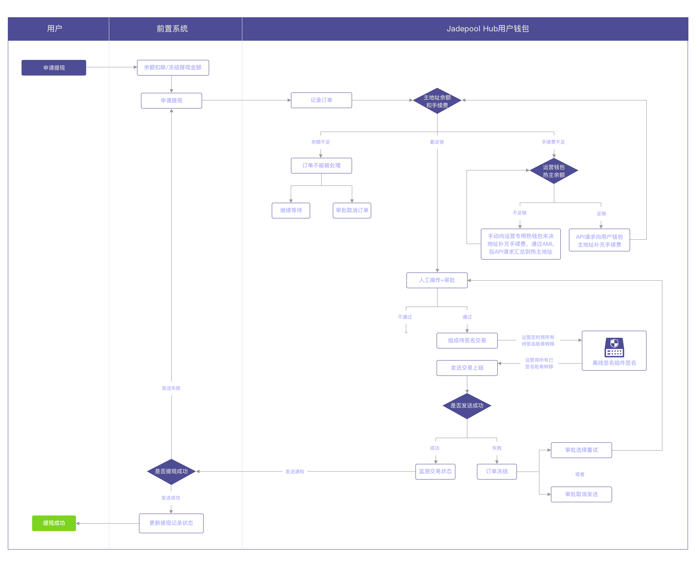

# 1.需求背景

为符合监管部门的监管要求，Jadepool Hub系统需要支持前置系统“每个用户拥有单独热钱包”的场景。在此场景中，用户之间的资产不会混在一起，并且所有进入托管的资金都先进入隔离地址经过AML审核，通过审核的资金正式成为被托管的可信任资金。

针对“用户98%资产存储在冷钱包”的要求，考虑到真实运营起来会有诸多不便，所以对用户的钱包采取去掉热钱包、用户可信任资产只存在冷钱包、运营方采取延时清算的方式。

# 2.场景方案简述

* 每个C端用户在Hub拥有专属的钱包
* 每个用户钱包分两层：充值地址和主地址
* 每个钱包可以有多个充值地址，每个使用的区块链有一个主地址
* 用户钱包的主地址拥有冷钱包性质，所有主地址的签名均在离线签名服务里完成
* 除用户专属钱包以外，前置系统需创建至少一个“运营专用热钱包”，“运营专用热钱包”的作用是承担该场景下的所有手续费
* 运营专用热钱包分三层：充值地址、热主地址和冷钱包地址
* 所有钱包的充值地址属于AML隔离层，主地址放置经过前置系统AML审核后的可信任资产

所有用户钱包的主地址都是离线签名，需要人工将待签名交易用文件形式搬运到离线签名服务所在的电脑上，签名完成后将文件搬运回Hub系统所在服务器。

所有用户钱包的主地址都由一个种子衍生，种子被加密并保管在离线签名服务Cold Signer所在目录下的文件中。

根据需求，用户钱包的所有充值地址、运营专用热钱包的充值地址和热主地址，不需要离线签名，Hub系统需要随时响应前置系统的请求并对这些地址签名发交易，所以这些地址是由另一个种子衍生，种子被加密并保管在在线系统连接的Seed Vault所在目录下的文件中。

# 3.流程

## 3.1 开户

每个用户在Hub系统拥有一个专属钱包，流程如下：

1. 用户在前置系统申请托管账户
2. 运营人员对用户的资质做审核
3. 审核通过后，前置系统调用Hub的API创建钱包。用户钱包mode是manual，运营钱包mode是safe。

## 3.2 充值

开户成功后，用户可以申请充值地址，并向地址进行充值。对每个币种可以申请多个充值地址。

### 3.2.1 未决地址

Jadepool Hub向用户提供的所有充值地址的性质都是“未决地址”，作用是作为“待验证”资产和“已验证”资产的缓冲隔离区，其中储存的资产用户不可以直接使用，需要经过前置系统的AML审核。审核通过后才能继续成为用户可使用的资产。

### 3.2.2 AML审核

入账到“未决地址”的资产都必须经过AML审核，AML审核由前置系统进行。

如果审核通过，前置系统通过传入订单ID调API的方式告知Hub系统，将充值订单的金额汇总到钱包主地址。如果汇总订单失败，前置系统需要再次发起汇总请求。

如果审核不通过，前置系统可以选择不处理这笔资产，留在地址里。或者通过传入另一个地址，将可疑资产转移出钱包。

整个前置系统和Hub的交互过程请参考[订单附件流程](biz-flow.html)。

## 3.3 汇总

汇总是前置系统在判断充值资产可信后通过API通知Hub系统将未决地址里的充值订单对应的资产金额转移到钱包主地址的行为。

### 3.3.1 主地址

经过AML审核通过后的资产都应该被汇总到主地址，主地址里的（来自用户充值的）资产对用户可用（具体金额和用户余额由前置系统控制），用户提现都是从主地址出帐。

### 3.3.2 汇总形式

为符合强监管场景，汇总将采用单独汇总的形式，即每一个未决地址的每一笔通过AML审核的充值金额都会被单独的交易汇总到热主地址，两笔充值金额不会被混在一起汇总。在手续费充足的情况下，一个未决地址发起汇总的次数等于地址收到的的充值通过AML审核的次数。

## 3.4 冷存储

该模式下，用户的钱包不存在热钱包，只存在AML隔离层和离线签名冷钱包。因为未决地址中的资产尚不属于用户可支配的资产。

运营专用钱包有热钱包和冷钱包，运营方可以自定义风控策略调整在冷热钱包资产的比例。运营热钱包的未决地址中的资产也不属于钱包可直接支配的资产。

运营人员可以按照监管要求对热钱包里每个代币设置：

  * 存储上限和目标余额，即热主地址超过该上限后就转一部分资产到冷钱包，热主地址剩余目标余额。

## 3.5 提现

用户的提现都只从钱包的主地址出账，所有用户钱包的主地址都是冷离线签名的形式，所以全程需要人工处理。步骤请参考[使用批处理](batch-tutorial.html)。

## 3.6 补充手续费

大部分区块链发送交易都需要支付手续费，但手续费币种不一定是用户使用产品时想充值的币种。所以用户钱包会出现交易因手续费不足而导致交易无法发送。根据需求，所有用户钱包消耗的手续费都由运营方承担，所以用户钱包中的资金流转所消耗的手续费都需要运营专用热钱包来补充。任意的用户钱包地址缺少手续费，前置系统应及时调用Hub转账API，由Hub预估手续费并从运营热钱包向缺少手续费的地址发起转账，手续费补充成功后方可进行后续流程。

前置系统需要对Hub系统的所有钱包（用户钱包和运营热钱包）的地址维护“手续费余额”，即每个地址中专用作手续费的剩余金额。所以，前置系统需要解析Hub所有订单回调，以计算每个地址收到的来自运营热钱包的补充和交易消耗手续费。如上文3.3所述，运营方需对Hub每个订单类型设置默认回调地址。

### 3.6.1 用户地址手续费余额监控

对于用户钱包的所有地址，运营方可以在前置系统设置一个阈值，如果地址剩余手续费低于阈值，则自动触发或人工审批触发补充手续费。监控到“手续费余额”短缺时前置系统应及时发起从运营热钱包补充手续费的请求。

**用户钱包充值地址的手续费必须及时补充并且需保持充足**，否则在极端情况下会出现Hub系统误用可疑资金的情况。因为Hub系统不区分可疑和可信资金，只要手续费足够，就构造交易并发送上链，但有可能使用的手续费正是没有被及时转移的可疑资金。这样会牵扯到后续补可疑资金本金的问题，也有可能违反监管规定。所以，补充手续费一定要在发起请求之前完成。

对于全新充值地址，前置系统不需要向地址立刻补充手续费，因为有可能用户不会使用地址。所以对新充值地址，补充手续费的行为应该是存在第一笔充值后触发的，即有过充值后，前置系统开始对地址维护手续费余额和补充阈值。

之后，如果监测到充值地址的手续费余额低于阈值后，应该停止所有对该地址出账的行为，发起补充手续费的请求，等待手续费补充订单成功后，再进行后续从该地址的出账请求。此举是为了避免使用其他充值的本金。

**注意：**为方便前置系统记录手续费，每笔向用户钱包补充的手续费都会被记录为“空投”类型的订单并通知到前置系统。

### 3.6.2 运营热钱包手续费余额监控

对于运营热钱包，前置系统需要监测该钱包的热主地址余额。运营方可以在前置系统设置一个对热主地址的监控阈值，如果地址剩余手续费低于阈值，则触发告警提醒人工手动向运营热钱包充值地址补充手续费，以防止用户钱包手续费不足而不能及时被补充，耽误用户钱包的交易发送。

**注意：**对于ETH来说，运营钱包的充值地址需要一直保留一笔ETH，不要请求Hub汇总到热主地址，否则会陷入没有手续费的死循环。