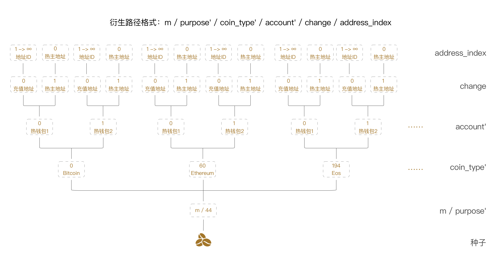

SeedVault可生成种子，被用来和瑶池生成的唯一衍生路径结合生成和还原私钥和衍生地址，并对交易进行签名。种子被加密存储于服务器本地，通过客户设置密码保护和设置白名单的方式以保证其安全性。另外，SeedVault也是一个数据保险箱，会存储很多瑶池重要数据，客户也需设置被瑶池用来组成交易的重要数据，例如冷钱包地址，这些数据都会被加密存储于服务器本地。

<!-- 热钱包服务和Seed Vault之间通信是⽤AES对称加密算法。热钱包服务和Seed Vault需要持有同⼀把密钥。当热钱包服务向Seed Vault请求种⼦时，Seed Vault会⽤密钥对种⼦进⾏加密然后返回，热钱包服务⽤密钥对加密种⼦进⾏解密得到种⼦的明⽂。
  -->
<!-- 
下图是衍生路径示意图： -->

 

