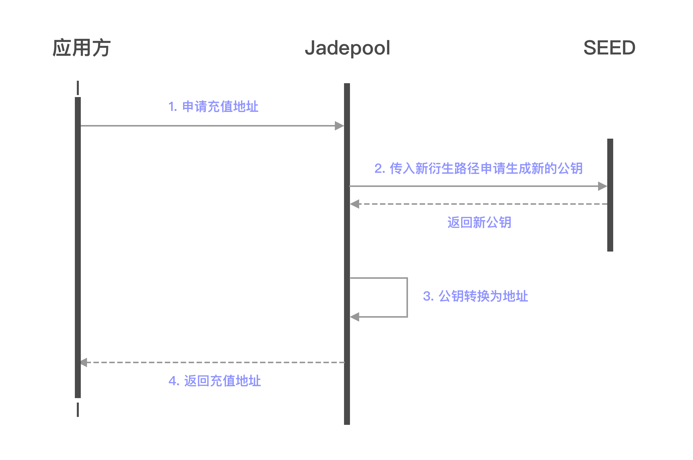
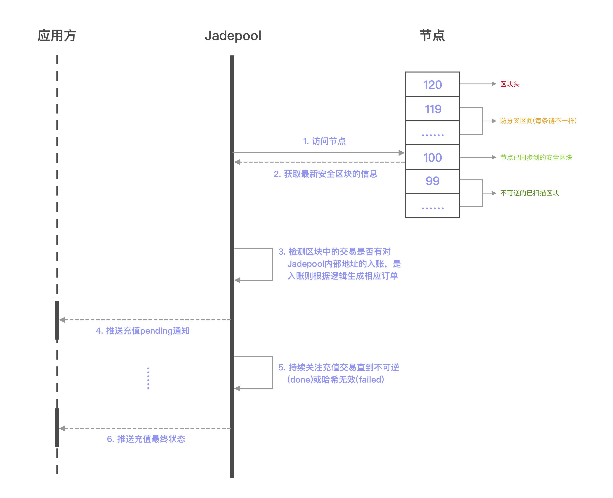

充值是Jadepool Hub的重要业务之一。用户只需要在Jadepool Hub获取一个欲充值币种的地址，然后用自己的钱包向该地址转账或者从平台提现。

在Jadepool Hub系统中启动的每条区块链都需要配置节点，随着节点不断和链的最高区块同步，Jadepool Hub会通过扫描节点最新同步到的区块中被打包的每笔交易进行判断，然后根据不同情况区分转账类型并将交易的信息以订单形式存储数据库。考虑到区块链的分叉可能性，Jadepool Hub为防止错误记录分叉期弱势链上的交易，对每个链都设置了符合该链情况的“防分叉检测间隔”参数。换言之，Jadepool Hub只扫描当前最高区块头减去“防分叉检测间隔参数”的高度以下的区块。交易被记录进数据库后，Jadepool Hub会一直跟踪交易直到最终状态，也就是向节点查询交易哈希以确保交易仍然在链上有效并且最终不可逆，最终无论交易成功或失败，Jadepool Hub都会保证将状态以回调的形式通知客户。若Jadepool Hub没有成功记录入账交易，客户仍可以通过“重新扫描区块”的方式再次扫描区块。

关于Jadepool Hub充值地址的地址模型详情请见[地址模型](../term/address-pattern.html)。

 

下图是获取充值地址场景下应用方和Jadepool Hub的交互流程图：

 

下图是充值流程图：

