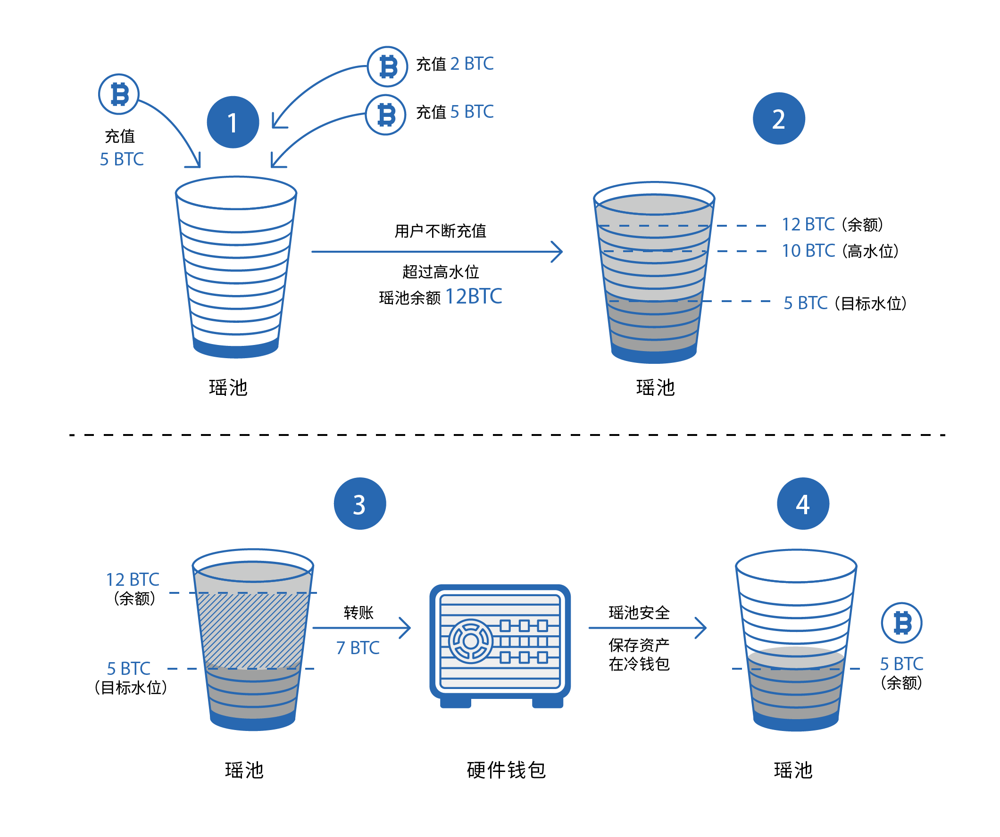

Jadepool Hub为保障运营方的资产安全设计了“热转冷”业务，应用方可自定义设置“冷钱包”，并通过Admin后台管理系统对每个资产设定高低水位和目标水位，当余额超过其高水位，Jadepool Hub会自主发起一笔热转冷交易，将资产安全转移。冷钱包不由Jadepool Hub控制。根据应用场景不同，应用方自定义“冷钱包”可以是安全硬件钱包，或矿机等。

 

下图是热转冷流程示意图：

 

