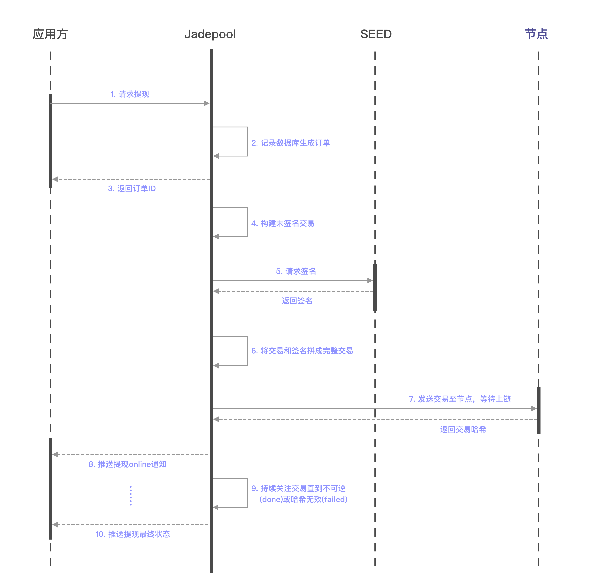

用户可提现的金额总小于用户在应用方存储的资产，取决于应用方对用户扣除的提现手续费的高低。但Jadepool Hub并没有用户被扣除手续费的信息，Jadepool Hub是按照自己的逻辑和算法计算交易矿工费，所以应用方对用户收取的手续费扣除Jadepool Hub发交易花费的区块链矿工费后才是应用方的收益。

Jadepool Hub接收到应用方的提现请求后，会向用户的提现地址发起转账。随着交易被区块链记录并确认，Jadepool Hub会通知客户系统该笔提现的到账情况。

关于Jadepool Hub出账详情请见[出账模型](../term/transfer-pattern.html)。

 

下图是提现流程图：

