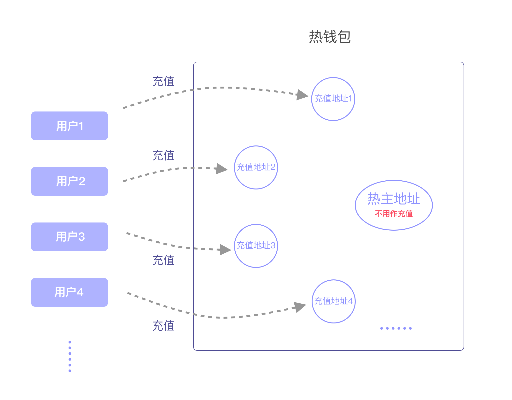
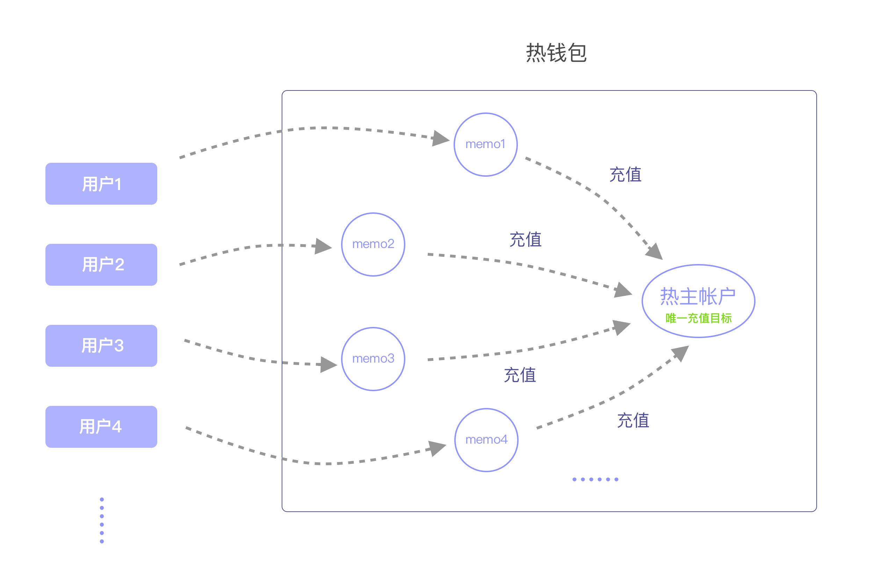

根据不同情况，每个区块链都有默认的地址模式。当应用方请求生成充值地址时，Jadepool Hub地址分为五种模式：默认(auto), 多地址普通(deposit), 单账户备注(deposit_memo), 隔离(safe_deposit)。以下是Jadepool Hub现已支持区块链支持的地址模式：

地址模式 | 区块链 
------ | ------- 
多地址普通 | Bitcoin, Ethereum, ERC20, Omni(USDT), Litecoin, Neo, VeChain, Qtum, Bitcoin Cash, TomoChain, Tron, Kusama, Polkadot, Tezos, QLink, Blockstack, PlatOn Alaya, Darwinia, Filecoin, Binance Smart Chain
单账户备注 | EOS, Ripple, Stellar, Cybex, EveriToken
两模式都支持 | Cosmos, IRISnet, ChainX, Binance
隔离 | 目前只支持Bitcoin, Ethereum

**注意**：应用方请求生成充值地址的模式如果是auto，即地址按照上表默认模式生成（对于Cosmos、IRISnet和ChainX来说，使用v2接口auto对应多地址模式）。如果应用方传入的地址模式Jadepool Hub不支持则会拒绝请求(API报错)。

### 多地址模式
应用方（调用Jadepool Hub生成新充值地址接口）为每个用户生成一个独特的充值地址，充值地址和用户的对应关系应存储在应用方数据库中，当Jadepool Hub通知应用方该充值地址接收到充值时，代表该充值地址对应的用户充值。Jadepool Hub只是单纯的钱包，没有任何用户的信息，为安全因素和方便资产管理考虑，Jadepool Hub会在资金池中进行资产汇总或打散，所以用户的充值地址在区块链上的余额并不代表用户在应用方系统的余额。对于utxo类区块链，充值地址和热主地址之间不会相互转账，出账来源可以是充值地址或热主地址。对于其他区块链，充值地址中的资产超过一定阈值会被汇总到热主地址，只有热主地址可以出账。

下图是多地址模式示意图：

### 单账户模式
该模式下一个热钱包只有一个热主帐户，所以所有C端用户的充值帐户(地址)是同一个，应用方（调用Jadepool Hub生成新充值地址接口）为每个用户生成一个独特的充值memo(备注或标签)，用户充值时需要将memo填写在充值交易中，Jadepool Hub通过区块链交易中的memo识别充值，应用方通过用户和memo的对应关系来判断充值用户。

下图是单账户模式示意图：

### 隔离模式
隔离模式的地址收到入账后，系统不会自动转移资产，前置系统需要对充值入账进行AML审核。审核通过后以API形式告知Jadepool Hub系统，系统会将充值资产转移到主地址。审核不通过运营方可以选择先留在充值地址中不做任何处理，或者从充值地址把资产退款回给用户。

<!-- ### 常规模式
normal模式是指，Jadepool Hub不会自发挪用充值地址的资产，所有行为都要应用方主动触发，该场景针对抵押和未来会新增的Dapp功能。在normal模式下，充值地址的抵押状态和Dapp资产状态代表用户在应用方的状态。
Jadepool Hub不会自发挪用充值地址的资产，所有行为都要应用方通过API主动触发。该模式给予应用方足够的自由操纵热钱包中热主地址和充值地址的资金流向。 -->

