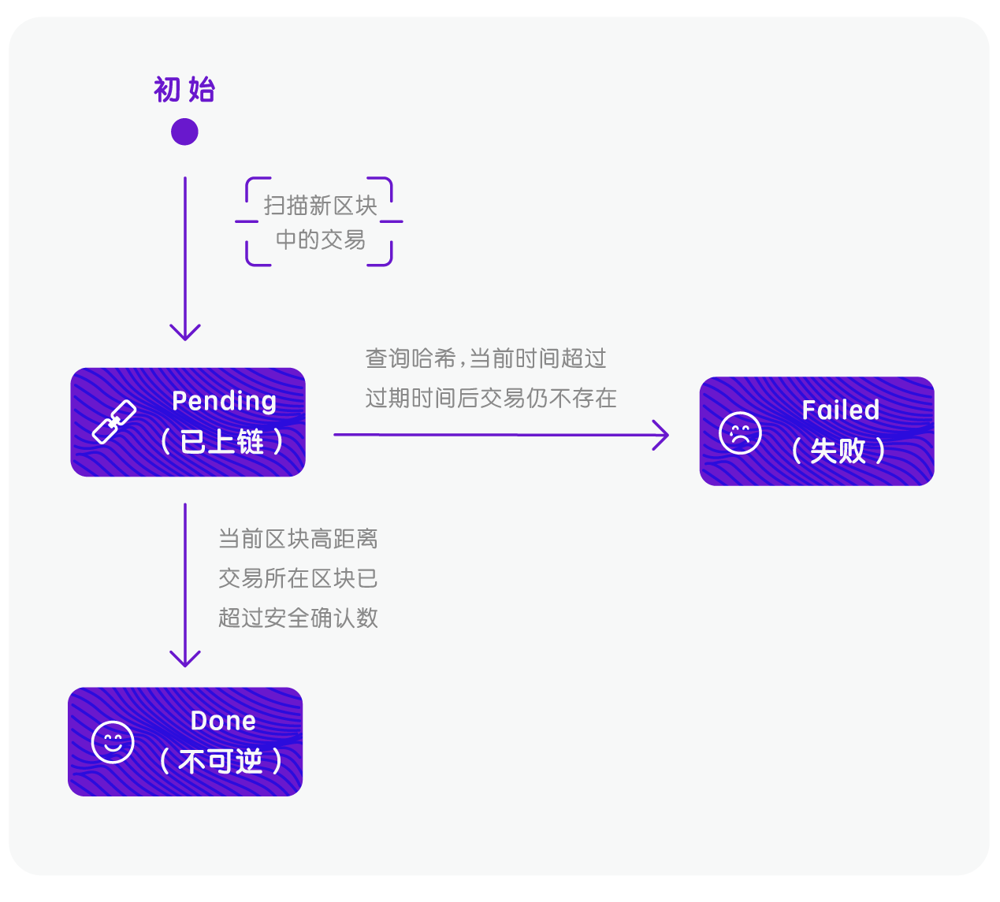
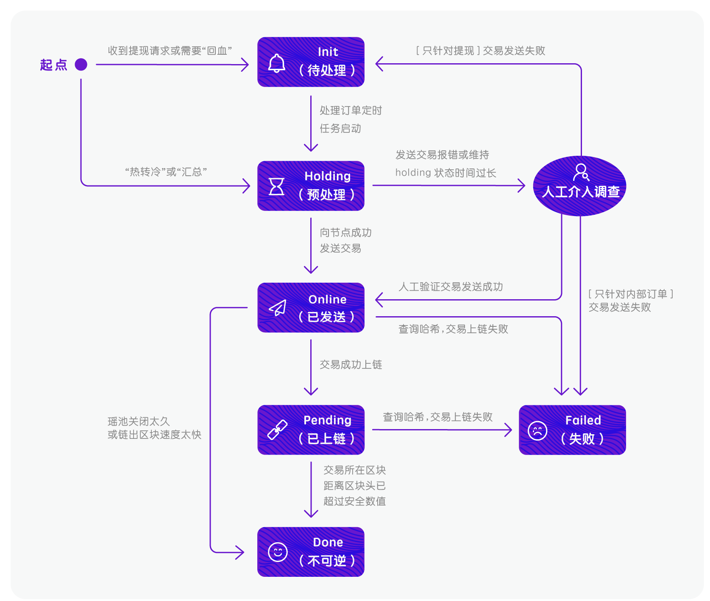

## 订单类型

订单类型 | 说明
--------- | ------- 
充值(DEPOSIT) | 检测到用户向Jadepool Hub生成的充值地址转账正确币种类型而生成的订单类型。
提现(WITHDRAWAL) | 收到提现请求后生成的订单类型。
热转冷(HOT-TO-COLD) | 余额高于高水位设置，自动触发热转冷转账而生成的订单。
冷转热(COLD-TO-HOT) | 检测到从冷钱包地址向热主地址转账而生成的订单类型。
异常入账(UNEXPECTED-IN) | 检测到内部地址以外的地址直接向热主地址的转账，或者充值地址收到memo填写错误的转账而生成的订单类型。
空投(AIRDROP) | 检测到从设置的空投地址发起的转账而生成的订单类型。空投来源地址可以设置多个。
内部出账(INTERNAL-OUT) | 内部地址向内部地址发起的转账（内部地址包括热主地址和充值地址），该类型是转出而生成的订单。
内部入账(INTERNAL-IN) | 为审计结果的准确性，每个内部出账订单对应一笔内部入账订单。
特殊入账(SPECIAL-IN) | 目前只有NEO的claim gas行为应用此订单类型。
区块链请求(SYSTEM-CALL) | 执行某些区块链行为产生的订单，区块链行为内容见下表。
撤销(REVERT) | 由于用户错误操作导致订单类型识别错误需要将原订单撤销并生成新的正确类型订单。此订单类型现仅用于用户充值时将memo填错而导致生成的未知入账(UNEXPECTED-IN)订单。
退款(REFUND) | 在admin管理系统上对异常入账订单进行处理发起退款生成的订单。

 

区块链行为 | 说明
--------- | ------- 
授权转币(Approve) | 充值地址授权热主地址可动用其余额的行为。

 

## 订单状态

订单状态 | 说明
--------- | ------- 
未处理(init) | 指Jadepool Hub已收到提现请求或已自主生成出账订单，但还未开始处理。
冻结(holding) | 将交易发上链前的预处理状态，订单长时间处于holding状态会被认为是异常订单并需要人工介入。
上链中(online) | 指Jadepool Hub已成功向节点发送交易（出账类订单）。
处理中(pending) | 指交易已成功上链并已被打包在某一区块中，但仍需一定数量的新区块产生以确认交易不可逆。
完成(done) | 订单最终状态，指交易已达到足够的区块确认数，交易不可逆。
失败(failed) | 订单最终状态，指交易失败。
取消(cancelled) | 订单因无法处理而被取消，例如：热转冷的金额不足、入账生成重复订单。前置系统发起请求生成的订单不会被取消。对该状态的订单不会发送通知。

 
入账状态机示意图

 
出账状态机示意图

