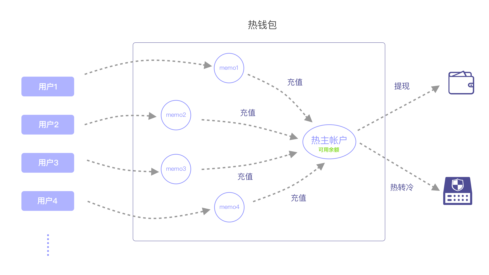
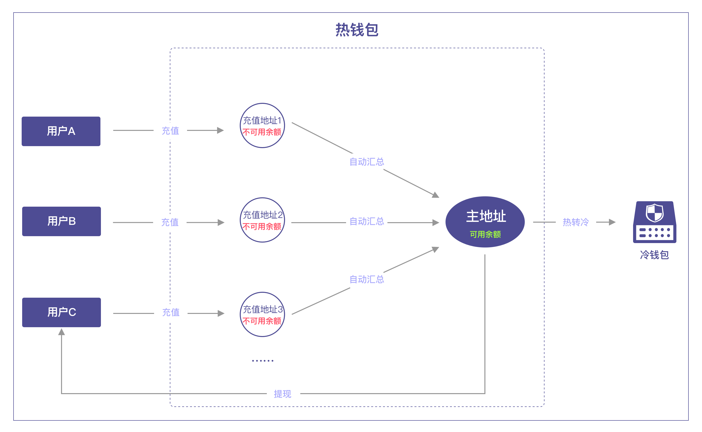
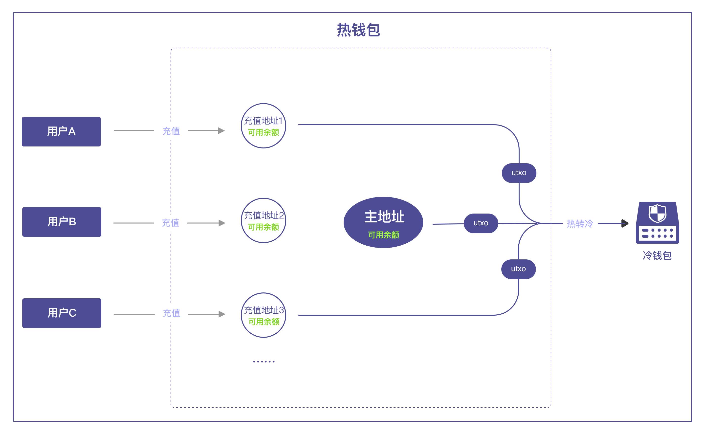

Jadepool Hub现支持的出账模式有以下三种，出账模式对于每个区块链是固定的，不能调整。

 

地址模式 | 出账模式 | 币种 
--------- | --------- | -------  
单账户备注 | 热主地址（帐户）出账 | EOS, Ripple, Stellar, Cybex, EveriToken, Cosmos, IRISnet, ChainX
多地址普通 | 汇总 + 热主地址（帐户）出账 | Ethereum, ERC20, Omni(USDT), Neo, VeChain, Cosmos, IRISnet, TomoChain, Tron, Kusama, Polkadot, Tezos, QLink, ChainX, Blockstack, Darwinia, Filecoin, PlatOn Alaya, Binance, Binance Smart Chain
多地址普通 | 充值地址和热主地址都可出账 | Bitcoin, Litecoin, Qtum, Bitcoin Cash

 

### 热主地址（帐户）出账
该出账模式是针对单账户备注类充值地址模式的区块链，示意图如下：

### 汇总 + 热主出账
该模式是针对每个用户拥有一个充值地址的币种，此类币种的交易模式一般是1对1，即一个交易的输入和输出只能有一个，或者地址需要管理nonce发交易。对于这些币种，Jadepool Hub为方便统一管理出账，用户充值到充值地址的资产需要被汇总到热主地址，所有出账统一从热主地址出。所以散落在充值地址的没有被汇总的金额被称为不可用余额。示意图如下：

### 充值地址和热主都可出账
该模式是针对utxo类区块链。utxo类区块链交易模式为m对n，即一个交易的输入和输出都可以有多个。所以充值地址和热主地址都有可能被包含在出账交易输入中，扣掉输出方和矿工费后找零会被作为一个新的utxo到热主地址。

