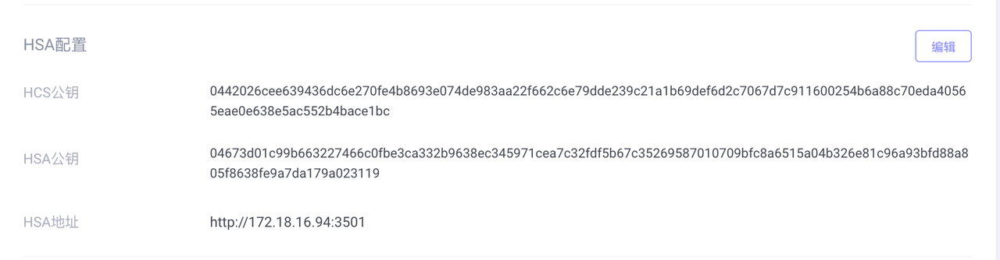

# HSA使用步骤
## 1.初始化
./hsa --init
初始化需要创建用户，密码和配置HCS公钥，该公钥从admin页面-系统服务配置-系统设置-HSA配置中获取，输入完毕后HSA公钥会自动生成并导出，需要将其配置在admin页面对应的HSA公钥中。
```bash
./hsa --init
Preparing initialization...
Please enter operator's username:
-> alice
Please enter operator's password:
-> *************
Please enter operator's password again:
-> *************
Please enter the public key of HCS (Hexadecimal):
-> 0442026cee639436dc6e270fe4b8693e074de983aa22f662c6e79dde239c21a1b69def6d2c7067d7c911600254b6a88c70eda40565eae0e638e5ac552b4bace1bc
publicKey:044becaa4cc865deb338c1d218d496497c7b9adc44ba4ab633a2272c2826bdab3b7fcaf32cbbf10b8e101d318981fb8901110db43e70e82b717566a71651623482
The exported file's folder: /root/test/hsa/demo/output/20210906121020_publicKey.json
```

## 2.设置HSM
./hsa hsm --setup
配置完hsm的slot和密码后，程序会自动测试与hsm的连接是否正常，正常后可继续下一步。
```bash
./hsa hsm --setup
Please enter operator's username:
-> alice
Please enter the password:
-> *************
Please enter the HSM's slot to login (Enter 0 to use the default slot,cannot change,be careful!!!):
-> 0
Please enter the HSM's login password:
-> ******
Please enter the HSM's login password again:
-> ******
Test connection to HSM is successful.
```

## 3.配置ip白名单
./hsa config --client
此处需要配置jadepool master所在机器的ip地址。
```bash
./hsa config --client
Please enter operator's username:
-> alice
Please enter the password:
-> *************
Please enter the Client IPs,split by common
-> 172.18.16.41
```

## 4.备份HSA
将hsa所在的整个目录备份，包括hsa，data，languages和lib

## 5.启动HSA
./hsa --server
hsa服务的默认端口为3501，启动时可以加--port来指定端口，启动后hsa即可正常使用，这里跟seed vault的使用方式一样，可在screen里启动hsa保持hsa的正常连接。
screen使用方法：https://linuxize.com/post/how-to-use-linux-screen/

```bash
./hsa --server
lock file successfully
Please enter operator's username:
-> alice
Please enter the password:
-> *************

   ____    __
  / __/___/ /  ___
 / _// __/ _ \/ _ \
/___/\__/_//_/\___/ v4.5.0
High performance, minimalist Go web framework
https://echo.labstack.com
____________________________________O/_______
                                    O\
⇨ http server started on [::]:3501
```

## 6.配置url
如下图所示，在admin页面-系统服务配置-系统设置-HSA配置中将hsa服务的url按照实际情况配置进去，此时HSA所有相关配置都已完成。


## 7.钱包选择私钥源
以上步骤完成后，在admin新建钱包，在钱包中开启区块链时可选择热钱包私钥源为HSM，选定提交后无法更改。


# HSA配置查询及修改
## 1.查询版本
./hsa --version
```bash
./hsa --version
Hot Signer Agent, Version 1.0.0
```

## 2.查询配置
./hsa info
```bash
./hsa info
Please enter operator's username:
-> alice
Please enter the password:
-> *************
HCS publicKey: 0442026cee639436dc6e270fe4b8693e074de983aa22f662c6e79dde239c21a1b69def6d2c7067d7c911600254b6a88c70eda40565eae0e638e5ac552b4bace1bc
HSA publicKey: 044becaa4cc865deb338c1d218d496497c7b9adc44ba4ab633a2272c2826bdab3b7fcaf32cbbf10b8e101d318981fb8901110db43e70e82b717566a71651623482
Seed Label: hsa-seed
Client ip: 127.0.0.1
```

## 3.修改HCS公钥配置
./hsa config --hcs
```bash
./hsa config --hcs
Please enter operator's username:
-> alice
Please enter the password:
-> *************
Please enter the public key of HCS (Hexadecimal):
-> 0442026cee639436dc6e270fe4b8693e074de983aa22f662c6e79dde239c21a1b69def6d2c7067d7c911600254b6a88c70eda40565eae0e638e5ac552b4bace1bc
```

## 4.修改密码
./hsa config --password
```bash
./hsa config --password
Please enter operator's username:
-> alice
Please enter the password:
-> *************
Please enter the new password:
-> ************
Please enter the new password again:
-> ************
```

## 5.验证
./hsa verify
备份hsa后，可进行验证，保证备份文件的正确性。
```bash
./hsa verify
Please enter operator's username:
-> alice
Please enter the password:
-> ************
Config Sha256: 2e7a472ed391f550f6745b7e65e85e99db69a65673f3407f595c24717f468bac
Verify ok
```