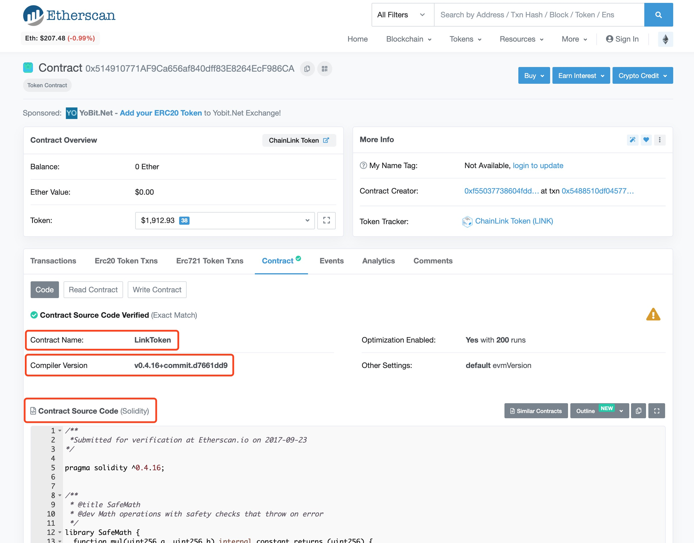
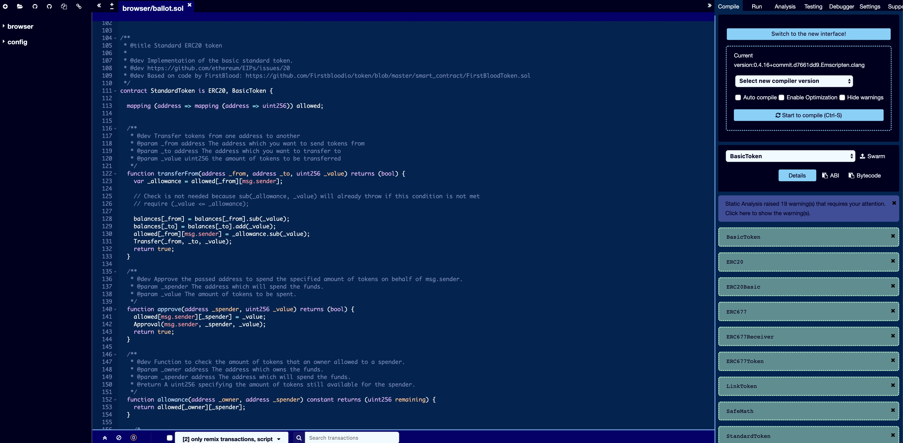
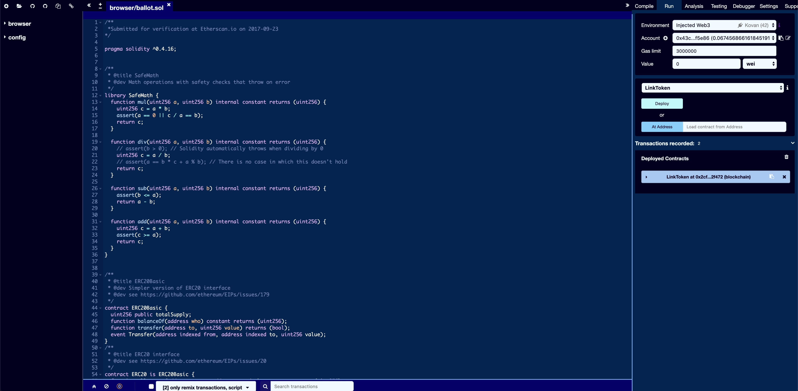
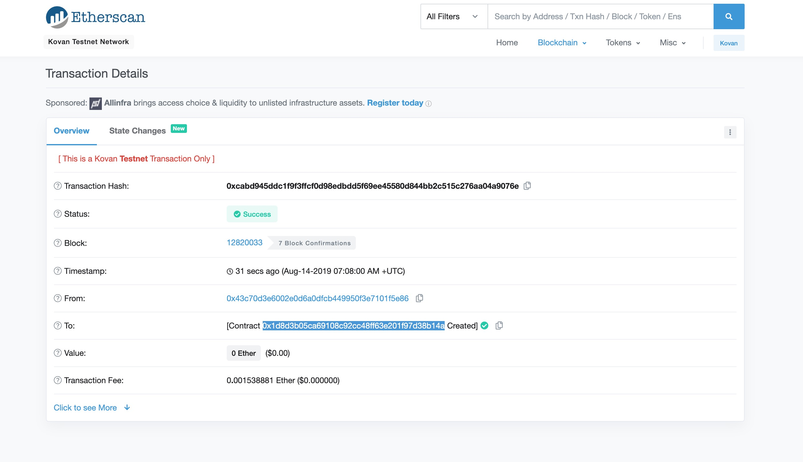

### 在Kovan发行ERC20

1. 在chrome浏览器安装[MetaMask](https://chrome.google.com/webstore/detail/metamask/nkbihfbeogaeaoehlefnkodbefgpgknn)插件，新建钱包并选择使用Kovan测试链。

2. 发布智能合约需要消耗ETH，如果帐户没有ETH，发布之前前往[Kovan水龙头](https://faucet.kovan.network)领取测试币。

3. 前往etherscan找到欲发布的智能合约，见下图。拷贝“Contract Source Code”里的智能合约源代码。

4. 前往[Remix在线编辑器](https://remix.ethereum.org/#optimize=false&evmVersion=null&version=soljson-v0.5.1+commit.c8a2cb62.js&appVersion=0.7.7)。粘贴智能合约源代码。

5. 在右侧“Compile”栏选择上图中红色圈出的“Compiler Version”，编译通过后如下图。

6. 在右侧“Run”栏选择上图中红色圈出的“Contract Name”，并点击“Deploy”。（此时MetaMask必须是已登录状态）

7. 此时MetaMask会弹出，要求确认发布智能合约交易。点击“Confirm”。

8. 发布智能合约交易如下图，智能合约“0x1d8d3b05ca69108c92cc48ff63e201f97d38b14a”创建成功。
